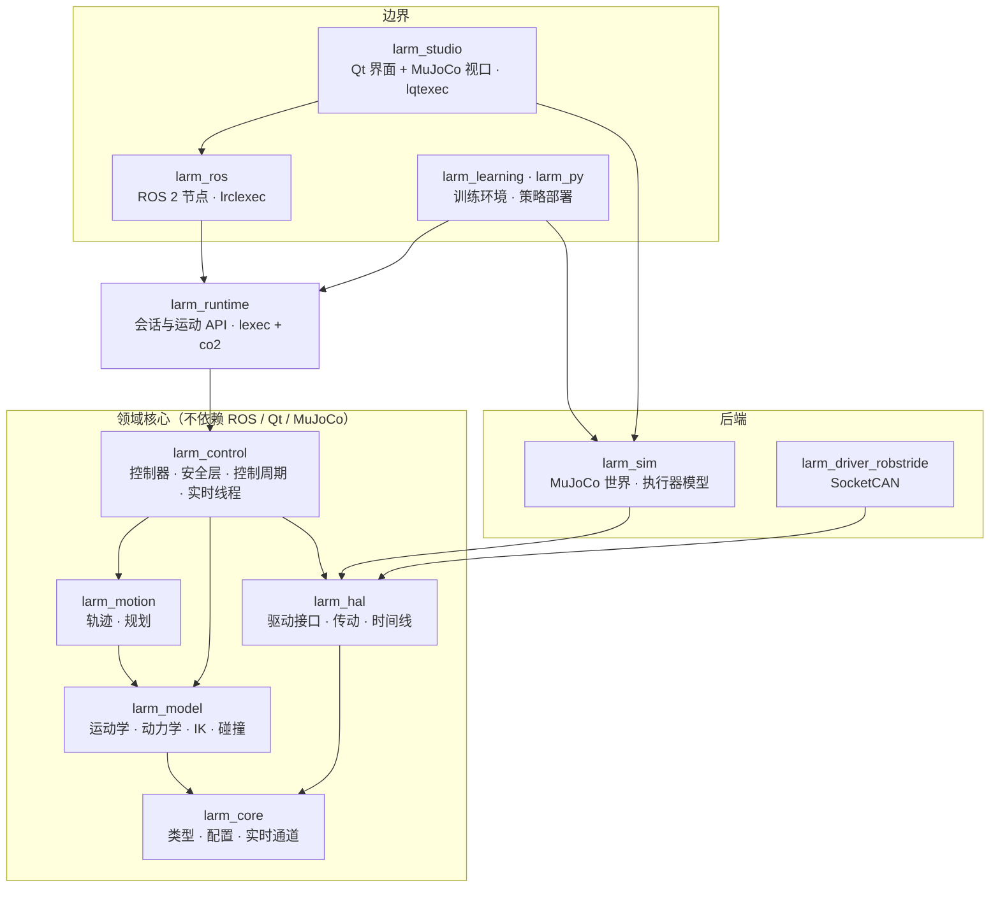
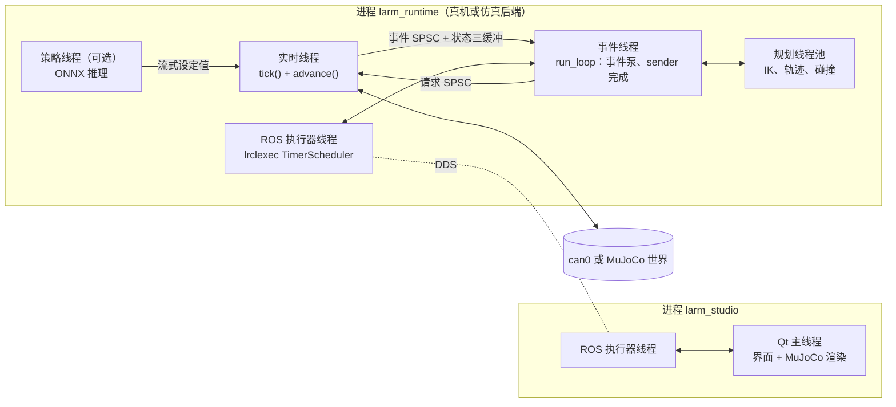
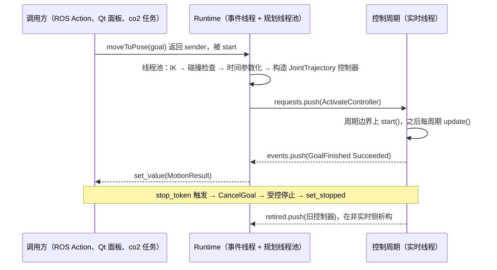

# lrebot_arm 架构设计

状态：草案 v0.1（2026-10-02）。本文给出通用机械臂框架（暂名 `larm`）的整体架构与模块设计，第一个落地机器人是 reBot Arm B601-RS。

## 1 目标与范围

- 一套与具体机械臂无关的控制框架：同一份模型、轨迹、控制器和安全层，既能接真机，也能接 MuJoCo 仿真，还能放进训练环境批量运行。
- 系统集成采用 ROS 2：对外用标准话题、Action、服务，能接 RViz、MoveIt、rosbag2。
- 用 MuJoCo + Qt 完成仿真、可视化操控和训练。
- 非实时编排统一用 sender/receiver：lrclexec 接 ROS 2，lqtexec 接 Qt；多步流程用 co2 协程书写。

不在范围内：电机 ID 写入、零点标定、参数模板写入（继续使用 MotorBridge Studio）；功能安全认证；真实相机驱动（用现有 ROS 驱动）。

## 2 已核实的约束

### 2.1 reBot B601-RS

来源：Seeed wiki、`~/rebot_env/reBotArm_control_py` 中的 `config/rebotarm_rs.yaml`、RS URDF、`docs/gravity_calibration_rs_2026-07-17.md`。

| 项 | 事实 |
|---|---|
| 关节 | joint1–6 为旋转关节；夹爪 1 个电机，URDF 中是两个直线指关节（joint_left 0–0.05 m，joint_right 0–0.0715 m，两者上限不一致，需要核对） |
| 位置限位 | J1 ±2.8，J2 0–3.14，J3 0–3.14，J4 ±1.57，J5 ±1.57，J6 ±3.14（rad） |
| 电机 | RobStride：J1–J3 为 RS-06（URDF 力矩上限 36 N·m），J4–J6 与夹爪为 RS-00（14 N·m）；ID 0x01–0x07，主机 ID 0xFD |
| 总线 | PCAN-USB → SocketCAN `can0`，1 Mbit/s；48 V 供电 |
| 电机模式 | MIT（位置、速度、kp、kd、前馈力矩）、POS_VEL（电机内部位置环，依赖写入的参数模板）、VEL |
| 现用 MIT 增益 kp/kd | J1 50/3，J2–J3 150/10，J4 50/5，J5–J6 50/4，夹爪 50/4 |
| 动力学 | 按 URDF 质量计算的重力模型误差 5–11%；电机零点与 URDF 零点一致，q=0 为伸展的停放姿态，此时夹爪触桌；各关节库仑摩擦 0.2–0.5 N·m，腕部摩擦与重力同量级 |
| 反馈 | 旧 Python 路径中 RS 固件的缓存位置曾冻结（主动上报帧未被解码）；参数 0x701A 读出的速度不是 rad/s，速度要对位置差分 |
| URDF 限速 | 40–50 rad/s，不能直接作为安全限值 |

总线预算：MIT 模式下每个电机每周期一条命令帧和一条应答帧，7 个电机共 14 帧。8 字节扩展帧约 131–155 bit（含位填充），1 Mbit/s 下每周期约 1.8–2.2 ms。500 Hz（2 ms）已接近或超过总线容量。默认控制频率定为 250 Hz（约 50% 总线负载），用 `canbusload` 实测后再调整；夹爪可以降频发送。

### 2.2 软件环境（本机）

Ubuntu 24.04、GCC 13.3、ROS 2 Jazzy。Jazzy 软件包：Pinocchio 4.1.0、Coal 3.0.3、Ruckig 0.9.2、ros2_control 4.48、MoveIt 2.12.4、tl-expected。Qt 6.8.3（`~/Qt`）与系统 Qt 5.15.13。MuJoCo 3.8.0 目前借用 Isaac Sim 预打包的 SDK，建议改装官方发布包到固定前缀。

### 2.3 自有库

- **lexec**：C++17 sender/receiver。含 `when_any`、`repeat`、`counting_scope`、`static_thread_pool`、`run_loop`、`any_sender_of`（connect 时分配一次）、co2 桥 `lexec/coro/co2.hpp`（需要异常）。
- **lrclexec**：ROS 2 执行器作调度器（`TimerScheduler`，支持 LifecycleNode 与 `/clock`）；`execute_action`、`call_service`、`wait_message`；抢占式 Action 服务端 `make_action_server_preempt`（先排空旧任务再启动新任务）；`spin_with_scope`、`SignalStop`。
- **lqtexec**：Qt 事件循环作调度器；`wait_signal`、`SignalChannel`；`ObjectScope`（工作随 QObject 生命周期收束）；`ThreadPoolScheduler`；`exec_with_scope`。
- **co2**：C++14 宏实现的无栈协程，`Task`、`Generator`、`AsyncGenerator`、`stop_token`；经 lexec 桥可直接 `CO2_AWAIT` 一个 sender。

本次验证：lexec + co2 桥在 `-std=c++20` 下编译运行通过；C++20 下 lexec 引入 `<execution>`，需要链接 TBB。lrclexec 与 lqtexec 都接受父工程提供的 `lexec::lexec`，整个程序只能有一个 lexec 提供者。`~/code/lockfree/fastqueue` 是按需分配节点的 MPMC 队列，不满足实时线程零分配的要求，不用于实时边界。

## 3 设计原则

*Scaling Robotics to 200 Developers*（CppCon 2026）给出的接口目标：稳定（接口长期不变）、高性能（热路径不分配，由调用方提供缓冲区）、可扩展（运动学、碰撞、物理后端可替换）、可读的现代 C++ 并带 Python 绑定；规划、控制、仿真尽量共用同一套类型；算法与类型分离。

本设计在此之上补充三条：

1. **控制代码只有一份。** 控制器与安全层不知道自己面对的是真机、交互仿真还是训练环境。差别只在硬件抽象和"谁拥有时间"。
2. **实时与非实时用类型隔开。** 实时线程只拿得到标注为实时安全的接口，不分配、不加锁、不用协程和 sender。可阻塞、可分配的工作在非实时侧完成，以不可变对象交给实时侧。
3. **核心不依赖 ROS、Qt、MuJoCo。** 三者只出现在边界模块。训练机器不装 ROS 和 Qt 也能构建核心、仿真与训练模块。

## 4 总体架构

### 4.1 组件



| 组件 | 职责 |
|---|---|
| Model | 机器人是什么：描述加载、正逆运动学、动力学、碰撞 |
| Motion | 怎么走：轨迹类型、轨迹生成、关节与笛卡尔规划 |
| Control | 这一周期输出什么：控制器、安全过滤、单周期步进函数、实时线程 |
| HAL | 机器人的身体：驱动接口、执行器与关节之间的传动换算、时间线 |
| Simulation | MuJoCo 世界、执行器模型、仿真传感器、参数随机化 |
| Runtime | 非实时编排：把实时内核包装成 sender 接口，负责规划卸载、事件泵、会话 |
| 边界 | ROS 2 集成、Qt 人机界面、训练与策略部署 |

划分理由：Model、Motion、Control 对应演讲中的运动学/动力学、轨迹/规划、控制三块，碰撞检查并入 Model。HAL 单独成模块，是为了让驱动只依赖接口、不依赖控制器。Simulation 同时服务于 HAL 后端、Studio 渲染和训练三方，所以独立。Runtime 与 ROS 分开，让 Studio、训练部署和测试可以在没有 ROS 的情况下使用同一套编排逻辑。

### 4.2 依赖规则

由 CMake 目标图强制：

- 依赖只能向下：边界 → Runtime → Control → Motion → Model → Core；Control、Simulation、驱动 → HAL → Core。
- `rclcpp` 只出现在 `larm_ros`、`larm_studio` 的 ROS 客户端部分和 `larm_msgs`；Qt 只在 `larm_studio`；MuJoCo 只在 `larm_sim` 与 Studio 视口；Pinocchio、Coal、Ruckig 只出现在实现文件中，公开头文件看不到它们。
- 只有组合根（各可执行文件的 `main`）选择具体实现并完成装配。

### 4.3 时间归属与运行模式

控制周期本身是一个纯步进函数（`ControlCycle::tick()`），推进时间的职责交给注入的 `Timeline`：

| 模式 | 时间所有者 | 推进方式 | `/clock` |
|---|---|---|---|
| 真机 | 单调时钟 | 实时线程睡到下一个绝对截止时刻 | 不发布，各节点用墙钟 |
| 交互仿真 | 仿真时间 | 实时线程推进一个控制周期的物理子步，再按实时倍率节流 | 由运行时节点发布 |
| 快速仿真（CI） | 仿真时间 | 同上，不节流 | 由运行时节点发布 |
| 训练 | `step()` 的调用方 | 训练循环直接调用 `tick()` 与 `advance()` | 无 |
| 镜像 | 真机 | Studio 只显示真机关节状态，不做物理 | 不涉及 |

MuJoCo 与控制周期在同一进程、同一线程中锁步，物理推进的关键链上没有 DDS、TCP 或渲染。运行时节点自己的定时器使用稳态时钟，不依赖自己发布的 `/clock`。

### 4.4 进程与线程



| 线程 | 运行内容 | 约束 |
|---|---|---|
| 实时线程 | `tick()` → `advance()` | 真机下 SCHED_FIFO、绑核、`mlockall`；不分配、不加锁、不进 ROS |
| 事件线程 | lexec `run_loop`；排空实时事件并完成对应 operation | 实时线程产生事件时写一次 eventfd 唤醒它 |
| 规划线程池 | lexec `static_thread_pool`，执行 IK、轨迹生成、碰撞检查 | 只做纯计算 |
| ROS 执行器线程 | `SingleThreadedExecutor` + lrclexec | 不阻塞；sender 完成后经 `continues_on` 回到这里 |
| 策略线程 | 按策略频率推理，写流式设定值 | 只在部署策略时存在 |
| Qt 主线程 | 界面、MuJoCo 渲染 | 渲染读取状态快照，使用独立的 `mjData` |

真机部署时另有 `robot_state_publisher`（由 `/joint_states` 与 URDF 发布 TF）；需要时启动 MoveIt `move_group`，通过 FollowJointTrajectory 驱动运行时。

### 4.5 三个库的位置

| 库 | 用在哪里 | 做什么 |
|---|---|---|
| lexec | Runtime | 运动 API 返回类型擦除的 sender；规划卸载到线程池；`when_any` 做超时；`counting_scope` 管理任务生命周期 |
| lrclexec | larm_ros | 运行时节点的 Action 服务端（抢占语义）、状态发布循环、`spin_with_scope` + `SignalStop` 收束；Studio 侧的远程会话用 `execute_action` / `call_service` / `wait_message` |
| lqtexec | larm_studio | ROS 完成结果 `continues_on` 回 GUI 线程；面板操作绑定 `ObjectScope`（面板关闭即停止它发起的运动）；按钮信号用 `SignalChannel`；`exec_with_scope` 收束 |
| co2 | 任务层 | 多步流程（抓放、标定例程、数据采集）、长循环；`CO2_AWAIT` 运动 API 返回的 sender |

实时线程内不使用其中任何一个。

## 5 核心契约

示意代码遵循项目 C++ 风格：`struct` 关键字、east const、指定初始化器、抽象接口 + 工厂函数、数据类只含公开字段。C++ 标准为 C++20（需要 `std::span` 与指定初始化器；lexec、co2 已验证可用）；非实时错误用 `larm::Expected<T>`（先别名到 `tl::expected`）。

### 5.1 数据类型

```cpp
namespace larm {

inline constexpr std::size_t kMaxDof = 16;
// 定容向量：运行期长度可变，存储在栈上，不分配
using JointVector = Eigen::Matrix<double, Eigen::Dynamic, 1, Eigen::ColMajor, kMaxDof, 1>;
using JointMask = std::bitset<kMaxDof>;

struct JointState {
    JointVector position;
    JointVector velocity;
    JointVector effort;
};

// 关节阻抗指令，MIT 协议的超集：tau = kp(q* - q) + kd(dq* - dq) + tau_ff
struct JointCommand {
    JointVector position;
    JointVector velocity;
    JointVector effort;
    JointVector stiffness;
    JointVector damping;
};

struct ActuatorStatus {
    bool enabled{};
    std::uint32_t faultBits{};
    float temperature{};
};

struct RobotState {
    std::uint64_t cycle{};
    SteadyTime stamp{};
    JointState joints;
    std::array<ActuatorStatus, kMaxDof> actuators{};
    bool isFresh{};   // 本周期所有关节反馈齐全且未超时
};

}
```

关节空间指控制空间，包含 reBot 的 6 个臂关节和 1 个夹爪关节（单位为米的开口宽度）。驱动可以工作在执行器空间，由传动适配器换算。

### 5.2 硬件抽象

```cpp
namespace larm::hal {

enum class CommandMode : std::uint8_t { Position, Velocity, Effort, Impedance };
enum class DrivePower : std::uint8_t { Disabled, Enabled };

struct DriverCapabilities {
    std::bitset<4> modes;               // 以 CommandMode 为下标
    std::chrono::nanoseconds minPeriod{};
    bool hasBrakes{};
};

// 只在实时线程调用：不分配、不加锁、耗时有界
struct RealtimeIo {
    virtual ~RealtimeIo() = default;
    virtual void read(RobotState &out) noexcept = 0;
    // 使能/失能也经由实时线程，保证总线只有一个写者；实际状态从 read() 返回
    virtual void write(JointCommand const &command, DrivePower requested) noexcept = 0;
};

// 时间所有者：真机睡到下个周期；仿真推进物理并按策略节流
struct Timeline {
    virtual ~Timeline() = default;
    virtual SteadyTime now() const noexcept = 0;
    virtual void advance() noexcept = 0;
};

// 非实时生命周期，可阻塞
struct RobotDriver {
    virtual ~RobotDriver() = default;
    virtual DriverCapabilities capabilities() const = 0;
    virtual Expected<void> connect() = 0;   // 打开总线，确认电机在线、参数与期望一致；电机保持失能
    virtual void disconnect() noexcept = 0;
    virtual RealtimeIo &io() = 0;
};

struct Backend {
    std::unique_ptr<RobotDriver> driver;
    std::unique_ptr<Timeline> timeline;
};

// 组合根把驱动工厂登记到注册表；配置里的 driver.type 选择其一
using BackendFactory = std::function<Expected<Backend>(RobotProfile const &, ConfigNode const &driverSection)>;

// 传动适配器：把执行器空间的 RealtimeIo 包装成关节空间
std::unique_ptr<RealtimeIo> makeTransmissionIo(RealtimeIo &actuatorIo, TransmissionTable const &table);

}
```

### 5.3 控制器与控制周期

控制器实例在非实时侧构造，目标（轨迹、夹爪宽度、流式邮箱指针）在构造时放入，所需内存在构造时分配。实时侧只做切换和调用，从不构造、析构控制器。

```cpp
namespace larm::control {

enum class ControlStatus : std::uint8_t { Running, Succeeded, Stopped, Failed };

struct ControlStep {
    ControlStatus status{};
    FaultCode fault{};
};

struct ControlContext {
    SteadyTime now;
    std::chrono::nanoseconds period;
    RobotState const &state;
    ModelCache const &model;   // 本周期已算好的 FK、雅可比、重力力矩，控制器与安全层共用
};

struct Controller {
    virtual ~Controller() = default;
    virtual JointMask claims() const noexcept = 0;       // 占用的关节；同时激活的控制器必须互不相交
    virtual hal::CommandMode mode() const noexcept = 0;
    virtual ControlStep start(ControlContext const &ctx) noexcept = 0;   // 从当前状态无扰接管
    virtual ControlStep update(ControlContext const &ctx, JointCommand &out) noexcept = 0;   // 只写 claims() 内的关节
    virtual void requestStop() noexcept = 0;             // 受控减速，之后以 Stopped 结束
};

// 一个控制周期：read → 处理请求 → 更新模型缓存 → 各控制器 → 安全层 → write → 发布快照与事件
struct ControlCycle {
    virtual ~ControlCycle() = default;
    virtual void tick() noexcept = 0;
};

std::unique_ptr<ControlCycle> makeControlCycle(ControlCycleDeps const &deps, ControlCycleConfig const &config);

}
```

没有被任何控制器占用的关节由 `HoldController` 填充，保证每个关节每周期都有指令。内置控制器：

| 控制器 | 用途 |
|---|---|
| Hold | 保持当前位置 + 重力补偿；默认控制器，也是故障反应 |
| JointTrajectory | 跟踪不可变轨迹，前馈重力或逆动力学；路径/终点容差监控；受控停止用 Ruckig 生成减速段 |
| JointStream | 流式关节目标（遥操作、策略输出），插值，超时即停 |
| CartesianServo | 末端速度 → 阻尼最小二乘微分 IK，带关节限位回避，超时即停 |
| Gripper | 宽度 + 力矩上限，检测堵转判定抓住 |
| GravityComp | 零刚度、小阻尼 + 重力前馈；用于拖动示教 |

安全层位于控制器之后、`write` 之前，按顺序执行：指令完整性 → 位置软限位 → 速度与加速度限幅 → 刚度、阻尼、力矩限幅 → 反馈新鲜度检查。故障分两类：目标级故障（流式输入超时、跟踪误差超限）只终止该目标，转入 Hold；系统级故障（某关节反馈丢失、电机故障码、越过硬限位）锁存，所有关节转入 Hold，必须显式复位。

使能流程也在实时线程内完成：`DrivePower::Enabled` 请求发出后，Hold 控制器以当前位置为目标，刚度在设定时间内从 0 爬升到标称值。

### 5.4 实时与非实时边界

```cpp
namespace larm::control {

struct ActivateController { GoalId goal; JointGroupId group; std::unique_ptr<Controller> controller; };
struct CancelGoal { GoalId goal; };
struct SetDrivePower { hal::DrivePower power; };
struct EmergencyStop {};
struct ResetFault {};
using ControlRequest = std::variant<ActivateController, CancelGoal, SetDrivePower, EmergencyStop, ResetFault>;

struct GoalFinished { GoalId goal; ControlStatus status; FaultCode fault; };
struct SafetyChanged { SafetyState state; FaultCode cause; };
struct PowerChanged { hal::DrivePower power; };
using ControlEvent = std::variant<GoalFinished, SafetyChanged, PowerChanged>;

struct RuntimeChannels {
    rt::SpscRing<ControlRequest, 64> requests;                // 非实时 → 实时
    rt::SpscRing<ControlEvent, 256> events;                   // 实时 → 非实时
    rt::SpscRing<std::unique_ptr<Controller>, 64> retired;    // 被替换的控制器退回非实时侧析构
    rt::LatestValue<RobotSnapshot> snapshot;                  // 三缓冲：状态、本周期指令、活动控制器、安全状态
    rt::SpscRing<CycleTelemetry, 4096> telemetry;             // 每周期计时与跟踪误差，供记录
};

}
```

`SpscRing`（定容、无分配、wait-free）和 `LatestValue`（三缓冲，写端从不阻塞）放在 `larm_core` 中，单元测试在 TSan 下运行。流式输入（遥操作、策略）各自持有一个 `LatestValue<StreamTarget>`，非实时侧写入，对应控制器读取。

一次运动的完整路径：



### 5.5 会话与运动 API

这是框架对上层的稳定接口。本地实现在 `larm_runtime`，远程实现（经 ROS 2）在 `larm_ros`；Studio、co2 任务、测试只依赖接口，不区分本地还是远程。

```cpp
namespace larm {

template <class... T>
using Async = lexec::any_sender_of<lexec::set_value_t(T...),
                                   lexec::set_error_t(std::exception_ptr),
                                   lexec::set_stopped_t()>;

struct MotionApi {   // 一个关节组的运动
    virtual ~MotionApi() = default;
    virtual Async<MotionResult> moveToJoints(JointGoal const &goal) = 0;
    virtual Async<MotionResult> moveToPose(PoseGoal const &goal) = 0;
    virtual Async<MotionResult> followWaypoints(JointWaypoints const &waypoints) = 0;
    virtual Expected<std::unique_ptr<StreamSession>> openStream(StreamConfig const &config) = 0;   // 遥操作、策略
};

struct GripperApi {
    virtual ~GripperApi() = default;
    virtual Async<GripResult> grip(GripGoal const &goal) = 0;
};

struct RobotSession {
    virtual ~RobotSession() = default;
    virtual Async<> enable() = 0;
    virtual Async<> park() = 0;                 // 回到停放姿态
    virtual Async<> disable() = 0;              // 不在停放姿态时拒绝，除非显式强制
    virtual Async<> resetFault() = 0;
    virtual void emergencyStop() noexcept = 0;
    virtual RobotSnapshot latest() const = 0;
    virtual MotionApi *motion(JointGroupId group) = 0;   // 取一次句柄，之后直接调用
    virtual GripperApi *gripper(JointGroupId group) = 0;
};

}
```

语义：

- 完成发生在运行时事件线程（远程实现中为 ROS 执行器线程），调用方用 `continues_on` 回到自己的上下文。
- 停止请求映射为受控停止，以 `set_stopped` 完成；规划失败、跟踪超差、系统故障以 `set_error(MotionError)` 完成。
- 同一关节组的新目标抢占旧目标：旧目标受控停止并以 stopped 完成，新目标从停稳状态开始。这与 lrclexec 抢占式 Action 服务端的语义一致。

### 5.6 任务层

```cpp
auto pickAndPlace(larm::RobotSession *robot, larm::Pose3 pick, larm::Pose3 place)
    CO2_BEG(co2::Task<>, (robot, pick, place), larm::MotionApi *arm{}; larm::GripperApi *hand{};) {
    arm = robot->motion(kArm);
    hand = robot->gripper(kGripper);
    CO2_AWAIT(hand->grip({.width = 0.05}));
    CO2_AWAIT(arm->moveToPose({.target = above(pick)}));
    CO2_AWAIT(arm->moveToPose({.target = pick, .path = PathKind::Linear}));
    CO2_AWAIT(hand->grip({.width = 0.0, .maxEffort = 5.0}));
    CO2_AWAIT(arm->moveToPose({.target = above(place)}));
}
CO2_END
```

任务取消时，co2 的 `stop_token` 经桥传给正在等待的 sender，最终变成实时侧的受控停止。

## 6 模块设计

每个模块对应一个 CMake 目标，命名空间为 `larm::<模块>`，头文件为 `<larm/<模块>/Foo.h>`。

### 6.1 larm_core

- 职责：基础类型（5.1）、`Pose3`、`Twist`、`Wrench`；时间类型；错误类型；机器人配置；实时原语 `SpscRing`、`LatestValue`。
- 机器人配置 `RobotProfile`：关节（名称、单位、限位、默认增益）、关节组（成员、基座帧、工具帧）、控制周期、安全参数、停放姿态、描述文件路径；`driver` 与 `sim` 段原样交给对应工厂解析。配置从 YAML 加载并在加载时校验，未知键报错。ROS 参数只用来指定配置文件和后端，不重复配置内容，这样训练环境不需要 ROS 也能读同一份配置。
- 依赖：Eigen、yaml-cpp、tl-expected。
- 验证：单元测试（配置解析与校验；实时原语在 TSan 下的并发测试）。

### 6.2 larm_model

- 职责：从 URDF 构建模型，提供运动学、动力学、逆解、碰撞检查。
- 接口：
  - `Kinematics`：`frame(name) -> optional<FrameId>`（冷路径，取一次 ID）；`update(q)`；`framePose(FrameId)`；`frameJacobian(FrameId, Eigen::Ref<Matrix6X>)`。按名字查询只在初始化时发生。
  - `Dynamics`：`gravity(q, out)`、`inverseDynamics(q, dq, ddq, out)`、`massMatrix(q, out)`；结果写入调用方的缓冲区，不分配。
  - `IkSolver`：`solve(IkRequest const &, std::span<double const> seed, IkSolution &out) -> IkStatus`；首个实现为带关节限位的 Levenberg–Marquardt，多初值。
  - `CollisionChecker`：自碰撞与环境基本体的距离、碰撞查询；用于规划阶段校验轨迹。
- 实现：Pinocchio（运动学、动力学）与 Coal（碰撞），隐藏在工厂函数后面。臂的模型由 URDF 去掉夹爪关节后得到。动力学参数可由配置覆盖 URDF 惯性参数。
- 验证：雅可比与数值差分对比；Pinocchio 与 MuJoCo 在随机构型下的 FK 一致性测试（同时检查 URDF 与 MJCF 是否一致）。

### 6.3 larm_motion

- 职责：轨迹类型、轨迹生成、规划。
- 接口：`JointTrajectory`：`duration()`、`sample(t, JointSample &out) const noexcept`（位置、速度、加速度）；对象不可变，实时侧求值不分配。
- 实现：`RuckigTrajectory`（多关节同步、限加加速度的点到点）；`WaypointTrajectory`（多路点 + 时间参数化）；笛卡尔直线在非实时侧用 IK 稠密采样转成关节轨迹。
- `MotionPlanner`（非实时）：目标 → IK → 碰撞检查 → 时间参数化 → `JointTrajectory`。全局避障规划需要时交给 MoveIt，MoveIt 输出经 FollowJointTrajectory 回到本框架执行。
- 验证：限值（速度、加速度、加加速度）、端点、连续性的单元测试。

### 6.4 larm_hal

- 职责：5.2 中的接口；`TransmissionTable`（方向、零点偏置、线性比例，覆盖夹爪的弧度 ↔ 米）与传动适配器；`MonotonicTimeline`（`clock_nanosleep` 绝对时刻，记录超时周期）；用于测试的 `FakeDriver`。
- 验证：传动换算的单元测试（含刚度、阻尼在比例下的换算）；`FakeDriver` 用于控制层测试。

### 6.5 larm_control

- 职责：5.3、5.4 中的控制器、安全层、`ControlCycle`；`RealtimeRunner`（RAII：构造时建线程并设置调度策略、绑核、锁内存，析构时停止并 join，统计唤醒延迟和超时周期）。
- 每周期的模型缓存：`ModelCache` 在每周期用当前 `q` 更新一次（FK、工具帧雅可比、重力力矩），控制器与安全层共用。
- 验证：在 `FakeDriver` 和 MuJoCo 后端上的确定性测试：阶跃与轨迹跟踪误差在界内、限位与限幅生效、超时停止、故障锁存与复位、控制器占用冲突被拒绝。

### 6.6 larm_sim

- 职责：MuJoCo 后端。
- `MujocoWorld`：持有 `mjModel` 与 `mjData`，按配置把关节名、执行器名绑定到 MuJoCo ID，加载场景物体。不做模型随机化时，多个世界共享同一个只读 `mjModel`；做随机化时每个世界持有自己的模型副本。
- `ActuatorModel`：把 `JointCommand` 转成关节力矩，在每个物理子步计算 MIT 律、力矩饱和、可选的指令延迟和量化。MJCF 中执行器为力矩型 `motor`。
- `SimulatedRobot`：实现 `RobotDriver`、`RealtimeIo` 和仿真 `Timeline`。`advance()` 执行一个控制周期内的全部物理子步（默认物理步长 0.5 ms，控制周期 4 ms 时为 8 步），节流策略为"按实时倍率"或"不节流"。失能时力矩为 0，可以在仿真中验证掉臂与安全反应。
- 场景快照：每帧把整个世界的 `qpos` 写入 `LatestValue`，供 ROS 发布给 Studio。
- 相机：离屏渲染（EGL）在独立线程中进行，用自己的 `mjData` 副本。
- 随机化 `Randomizer`：在 reset 时扰动质量与质心、关节摩擦、增益、延迟、传感器噪声；默认范围参考重力标定结果（质量 ±10%，库仑摩擦 0.2–0.5 N·m）。
- 风险：显式计算的阻尼项 kd 在小惯量腕关节上可能要求更小的物理步长。需要按最小等效惯量验证稳定性；不稳定时改用 MuJoCo 执行器 + `implicitfast` 积分器隐式处理阻尼。

### 6.7 larm_driver_robstride

- 职责：通过 SocketCAN 直接驱动 RobStride 电机的 `RobotDriver`。
- 结构：
  - `RobStrideCodec`：帧编解码（运控、反馈、使能、失能、参数读写、故障上报），纯函数。
  - `CanSocket`：RAII 套接字，非阻塞收发，批量发送。
  - `RobStrideBus`：实时侧状态机。`write()` 发出本周期全部运控帧；`read()` 非阻塞排空接收队列，用上一周期指令的应答更新状态；使能、失能序列分布在若干周期内完成。
  - 速度估计：反馈中的速度与位置差分在调试期做对比，按结果决定使用哪一个，必要时做滤波。
- `connect()`：逐个 ping 电机；只读核对参数模板；关闭主动上报；若固件支持，配置电机侧 CAN 超时，让主机崩溃时电机自行进入安全状态。参数不一致时拒绝继续。
- MotorBridge 不进入运行时路径，继续用于调试期交叉核对和电机初始化。
- 风险：协议细节以 RobStride 协议手册为准，实现前逐条核对；编解码先用手册样例帧做单元测试。

### 6.8 larm_runtime

- 职责：5.5 中 `RobotSession`、`MotionApi`、`GripperApi` 的本地实现。
- 组成：
  - `RuntimeHost`：持有后端、`ControlCycle`、`RealtimeRunner`、通道、事件线程（lexec `run_loop`）、规划线程池（`static_thread_pool`）、`counting_scope`。
  - 事件泵：实时线程有事件时写一次 eventfd；事件线程被唤醒后排空 `events` 与 `retired`，按 `GoalId` 完成对应 operation。
  - `ControllerFactory`：按目标构造控制器实例（非实时，允许分配）。
  - `StreamSession`：持有 `LatestValue<StreamTarget>` 与对应控制器；关闭会话即释放占用。
- 验证：以 MuJoCo 后端快速仿真为底座的 sender 语义测试：成功、取消即受控停止、抢占、故障转 error、关闭时排空。

### 6.9 larm_msgs 与 larm_ros

- `larm_msgs`：`ArmStatus`（电源、安全状态、故障码、各组活动控制器）、`SceneState`（模型摘要 + 全世界 `qpos`）、Action `MoveToPose`、`MoveToJoints`、`RunPolicy`；其余用标准消息。
- 运行时节点 `larm_runtime_node`（LifecycleNode，组合根）：

| 生命周期转换 | 动作 |
|---|---|
| configure | 加载配置，构造模型与后端，启动实时线程；电机失能，只发布状态 |
| activate | 使能电机，进入 Hold，打开所有指令接口 |
| deactivate | 停止全部目标；处于停放姿态时失能，否则转换失败并保持（先调用 `~/park`） |
| cleanup | 停止实时线程，断开后端 |

- 接口：

| 类型 | 名称 | 消息 |
|---|---|---|
| 发布 | `/joint_states` | `sensor_msgs/JointState` |
| 发布 | `~/status` | `larm_msgs/ArmStatus` |
| 发布 | `~/joint_command` | `sensor_msgs/JointState`（安全层输出的指令位置，供示教录制） |
| 发布（仿真） | `/clock`、`~/sim/scene_state`、相机图像 | `rosgraph_msgs/Clock`、`larm_msgs/SceneState`、`sensor_msgs/Image` |
| Action | `~/<组>/follow_joint_trajectory` | `control_msgs/FollowJointTrajectory`（MoveIt 可直接使用） |
| Action | `~/<组>/move_to_pose`、`~/<组>/move_to_joints` | `larm_msgs` |
| Action | `~/gripper/gripper_command` | `control_msgs/GripperCommand` |
| Action | `~/run_policy`（启用 ONNX 时） | `larm_msgs/RunPolicy` |
| 订阅 | `~/<组>/servo/twist`、`~/<组>/servo/joint_jog` | `geometry_msgs/TwistStamped`、`control_msgs/JointJog` |
| 订阅 | `~/<组>/stream/joint_target` | `sensor_msgs/JointState`（外部策略节点的流式关节目标） |
| 服务 | `~/emergency_stop`、`~/reset_fault`、`~/park` | `std_srvs/Trigger` |

- Action 服务端用 `make_action_server_preempt`，工厂返回 `MotionApi` 的 sender 再 `continues_on` 到 ROS 调度器；状态发布是 co2 循环或 lexec `repeat`，读取 `LatestValue` 快照。
- `RosRobotSession`：`RobotSession` 的远程实现，基于 `execute_action`、`call_service`、`wait_message`，供 Studio 与远程脚本使用。
- 收束遵守 lrclexec 的约束：不在执行器回调中对依赖同一执行器的 sender 做 `sync_wait`；Action 客户端与服务端活到执行器停止之后。
- 验证：`launch_testing` 启动快速仿真后端，用 Action 客户端执行轨迹并检查结果。

### 6.10 larm_studio

- 职责：Qt 6 桌面程序，用于观察、操控、录制。
- 组合根：`QApplication`、lqtexec `EventLoopContext`、ROS 执行器线程、`RosRobotSession`、场景来源、主窗口。
- 视口 `MujocoViewport`：`QOpenGLWindow` 经 `QWidget::createWindowContainer` 嵌入，申请兼容配置的 OpenGL 上下文。原因：MuJoCo 3.8 的 `mjFB_WINDOW` 指默认帧缓冲，而 `QOpenGLWidget` 渲染到自己的 FBO。渲染使用视口自己的 `mjData`，叠加层包括目标位姿的"幽灵"机械臂、轨迹折线、坐标系。
- 场景来源 `SceneSource`：仿真时订阅 `~/sim/scene_state`；真机时由 `/joint_states` 填机器人关节（镜像）；回放时读取录制文件。
- 面板：会话（使能、停放、急停、状态）、关节（点动滑块、实时值）、笛卡尔（目标位姿、拖动视口中的目标、点动）、轨迹（路点、规划预览、执行）、夹爪、遥测曲线、录制。
- 每个面板持有 `ObjectScope`，发起的运动随面板关闭而停止；"停止"按钮触发该 operation 的停止请求。
- 遥操作：键盘、手柄或 SpaceMouse 以 50–100 Hz 发布伺服指令。
- 验证：脚本模式按日志推进真实界面路径并截图（参照 lqtexec widgets 示例）；视口需要真实 GL 上下文，在 X11 或 Xvfb + Mesa 下运行。

### 6.11 larm_learning 与 larm_py

职责：示教数据采集、策略部署、训练环境。先做模仿学习，强化学习环境随后。

**模仿学习（先做）**

- 示教来源：Studio 遥操作（仿真或真机，笛卡尔伺服或关节点动）与 GravityComp 拖动示教（真机）。
- 录制：rosbag2（MCAP）录制 `/joint_states`、`~/joint_command`（安全层输出的指令位置）与相机图像。仿真示教与真机示教走同一条管线，相机分别来自 MuJoCo 离屏渲染和真实相机驱动。
- 转换：Python 脚本把 MCAP 按策略频率对齐重采样，写成 LeRobot 数据集。动作取指令位置；拖动示教时刚度为零、指令位置没有意义，改取下一时刻的测量位置。
- 训练：在 LeRobot 中进行，框架不重新实现。
- 部署：LeRobot 策略是 PyTorch 模型，不一定能顺利导出 ONNX。第一版由 Python 推理节点订阅关节状态与图像，向 `~/<组>/stream/joint_target` 发布关节目标，运行时用 JointStream 控制器加安全层执行，输入超时即停。真机与仿真走同一路径，先在仿真中验证再上真机。

**强化学习环境（随后）**

- 接口：

```cpp
namespace larm::learning {

struct Task {   // 训练任务本身：初始分布、观测、奖励、终止
    virtual ~Task() = default;
    virtual ObservationSpec observationSpec() const = 0;
    virtual void reset(TaskContext &ctx, Rng &rng) = 0;
    virtual void observe(TaskContext const &ctx, std::span<float> out) const = 0;
    virtual StepOutcome evaluate(TaskContext const &ctx) const = 0;   // reward、terminated、truncated
};

struct ActionAdapter {   // 策略动作 → 流式设定值；训练与部署共用
    virtual ~ActionAdapter() = default;
    virtual ActionSpec actionSpec() const = 0;
    virtual void apply(std::span<float const> action, RobotState const &state, StreamTarget &out) const = 0;
};

struct VectorEnvironment {
    virtual ~VectorEnvironment() = default;
    virtual void reset(std::span<std::uint64_t const> seeds, BatchView out) = 0;
    virtual void step(std::span<float const> actions, BatchView out) = 0;   // N×A → 观测 N×O、奖励 N、结束标志 N
};

}
```

- 一个环境 = `MujocoWorld` + `SimulatedRobot` + `ControlCycle`（与真机相同的控制器和安全层）+ `Task` + `ActionAdapter`。频率分三层：策略周期 = k 个控制周期，控制周期 = m 个物理子步。
- `VectorEnvironment` 持有 N 个环境，用 lexec `bulk` 在线程池上并行 `step`，自动 reset。
- 观测分两部分：本体观测（关节状态等）的构造代码由训练与部署共用；任务观测在仿真中取真值，在真机上由感知话题提供，经 `ObservationSource` 接口注入。
- `larm_py`：pybind11 模块，numpy 零拷贝；Python 侧提供 Gymnasium `VectorEnv` 包装。Python 版本与 ROS Jazzy 一致（3.12）。
- 部署：策略导出 ONNX，由 `PolicyRunner` 加载。它在策略线程中按策略频率推理，观测构造与 `ActionAdapter` 与训练共用同一份代码，输出写入 `RobotSession` 打开的 `StreamSession`；运行时节点在启用 ONNX 时装配它。模仿学习策略能导出 ONNX 时也可改走这条路径，省去 Python 推理节点。
- 验证：固定种子下的确定性重放；单环境与批量环境结果一致；环境步进吞吐量基准。

## 7 reBot B601-RS 落地

机器人相关的内容全部是数据和启动文件，代码都在框架内：

- `rebot_b601_description`：URDF、网格、MJCF。MJCF 由同一份 URDF 编译后补充：力矩型执行器（`ctrlrange` 等于力矩上限）、关节 `armature` / `damping` / `frictionloss`（摩擦取标定值）、两指的 `equality joint` 耦合、相邻连杆的接触排除；桌面与物体放在单独的场景文件中，引用机器人文件。
- `rebot_b601_bringup`：配置文件、launch（真机、仿真、Studio）、RViz 配置；MoveIt 配置在需要时补充。

配置文件示意（`待定` 项需要标定或实测）：

```yaml
robot: rebot_b601_rs
description:
  urdf: package://rebot_b601_description/urdf/rebot_b601_rs.urdf
  mjcf: package://rebot_b601_description/mjcf/rebot_b601_rs_scene.xml
control:
  period_us: 4000
joints:
  - {name: joint1, position: [-2.8, 2.8], effort: 36.0, velocity: 待定, gains: {kp: 50.0, kd: 3.0}}
  - {name: joint2, position: [0.0, 3.14], effort: 36.0, velocity: 待定, gains: {kp: 150.0, kd: 10.0}}
  # joint3 … joint6 同理
  - {name: gripper, unit: meter, position: [0.0, 待定], effort: 待定, gains: {kp: 50.0, kd: 4.0}}
groups:
  arm: {joints: [joint1, joint2, joint3, joint4, joint5, joint6], base: base_link, tool: gripper_end}
  gripper: {joints: [gripper]}
safety:
  feedback_timeout_cycles: 待定
  stream_timeout_ms: 待定
  tracking_error_limit: 待定
  rest_pose: [0, 0, 0, 0, 0, 0, 0]
driver:
  type: robstride_socketcan
  interface: can0
  host_id: 0xFD
  motor_timeout_ms: 待定
  actuators:
    - {joint: joint1, id: 0x01, model: rs-06}
    # joint2、joint3 为 rs-06；joint4 … joint6 为 rs-00
    - {joint: gripper, id: 0x07, model: rs-00, transmission: {type: linear, meters_per_radian: 待定}}
sim:
  timestep_us: 500
```

该机械臂没有抱闸，失能后会在重力下落下。因此：失能只在停放姿态（q=0，夹爪由桌面支撑）执行；故障反应默认是保持而不是失能；主机失联时只能依靠电机侧 CAN 超时，该功能需要在 RobStride 手册中确认，不支持时只剩物理支撑和断电急停。同一框架换成 B601-DM（达妙电机）时，新增一个达妙驱动和一份配置即可，其余不变。

## 8 工程结构

```text
lrebot_arm/
  larm/                        # 一个 CMake 工程，同时是一个 ament 包
    core/  model/  motion/  hal/  control/  sim/
    drivers/robstride/
    runtime/  ros/  studio/  learning/  python/
    apps/                      # 组合根：larm_runtime_node、larm_studio、larm_sim_cli、larm_driver_probe
  larm_msgs/                   # rosidl 接口包
  robots/rebot_b601/
    rebot_b601_description/
    rebot_b601_bringup/
  deps.repos                   # lexec、co2、lrclexec、lqtexec 的固定提交
  docs/
```

- 选择一个 CMake 工程加多个目标，而不是每个模块一个 ament 包：lexec 目前没有安装导出，跨包共享同一个 lexec 提供者很麻烦；单工程内可以在顶层先提供 `lexec::lexec`，再加入 lrclexec、lqtexec 与 co2，保证全程序只有一个提供者。模块边界由目标依赖保证。
- 选项：`LARM_WITH_ROS`、`LARM_WITH_QT`、`LARM_WITH_PYTHON`、`LARM_WITH_ONNX`。训练机器可以只构建核心、仿真与训练模块。
- 外部依赖来源：先用父工程或本地源码目录（与 lrclexec、lqtexec 现有做法一致），否则 FetchContent 拉取固定提交；`CMakePresets.json` 提供 debug、asan、tsan、release 配置；编译警告按项目 C++ 风格开启。

## 9 验证策略

确定性模块用单元测试锁定行为：core、model、motion、hal 的传动、control（在 FakeDriver 与快速仿真上）、RobStride 编解码、runtime 的 sender 语义、learning 的确定性重放。

依赖真实环境的模块用独立的开发入口验证：

- `larm_driver_probe`：真机调试入口。默认只读（扫描、监视状态）；使能保持、单关节小幅运动各需要单独的显式开关；输出 JSONL 便于比对。
- `larm_sim_cli`：不经 ROS，直接在 MuJoCo 中运行一个场景（轨迹、阶跃、故障注入），输出跟踪误差和计时统计。
- Studio 脚本模式；ROS `launch_testing`。

仿真到真机的对照：同一条轨迹分别在仿真和真机上执行，比较跟踪误差、力矩和计时，用于调整执行器模型与随机化范围。

## 10 实施顺序

每一步都产出可以运行和验证的纵向切片：

1. **核心与仿真闭环**：core、model、motion、hal、control、sim、`larm_sim_cli`。完成标准：在 MuJoCo 中确定性地跑完一条轨迹，各项测试通过，URDF 与 MJCF 一致性测试通过。
2. **运行时与 ROS 2**：runtime、msgs、ros。完成标准：仿真后端下 FollowJointTrajectory、MoveToPose、夹爪、急停、抢占在 `launch_testing` 中通过；RViz 显示正常。
3. **Studio**：视口、会话、关节、笛卡尔、轨迹面板。完成标准：脚本模式走通主要流程。
4. **真机**：RobStride 驱动，按"只读 → 使能保持 → 单关节小幅运动 → 慢速轨迹"逐级上真机；实测总线负载与周期抖动，确定控制频率。
5. **示教与模仿学习**：遥操作与拖动示教录制、MCAP → LeRobot 转换、Python 推理节点经流式关节目标部署；先仿真后真机。
6. **强化学习**：learning 环境、larm_py、示例任务（末端到达），PPO 训练，ONNX 部署到仿真再到真机。

## 11 被否决的方案

- **以 ros2_control 为实时内核**：控制器只能作为 controller_manager 插件运行，无法以每秒上万步的速度放进训练环境，训练与部署会形成两份控制代码；命令与状态接口以字符串命名。MoveIt 兼容性通过 FollowJointTrajectory Action 获得。
- **MuJoCo 作为独立进程，经 ROS 话题或 TCP 与控制器同步**：物理推进的关键链上出现 DDS、序列化和进程调度，时间所有权不清，结果不可重放。
- **实时线程内使用 sender 或协程**：operation 的分配和完成时机不受控，无法保证周期内有界。
- **以 Python 为运行时**：GIL 与解释器抖动不适合周期控制；Python 留在训练和脚本层。
- **Studio 内嵌运行时与仿真（单进程）**：界面崩溃会连带停掉机器人控制；而真机场景下界面本来就是客户端。保留 `RobotSession` 接口，将来如需单进程模式可以加入本地实现。
- **以 URDF 的 8 个关节（含两个指关节）作为控制空间**：两个指关节由同一个电机驱动，不能独立控制；控制空间取 7 个可驱动自由度，耦合交给传动与 MJCF 约束。

## 12 对既有实现的评估

- `~/rebot_env/reBotArm_control_py`（Python SDK）：配置驱动的关节分组、无夹爪时的空操作组、按组切换 MIT / POS_VEL 都是对的，本设计的配置结构沿用了这些概念。问题在于控制循环靠 `time.sleep` 定时，每次读状态都要额外发请求帧，模式切换中夹杂多处固定延时，导致周期与延迟都无界。
- `~/rebot_env/rebotarm_ros2/src/rebotarm_mujoco_rs`：仿真通过订阅 `JointState` 同步或用保守 PD 跟踪，仿真中运行的不是真机上的控制器，仿真结论无法迁移到真机。
- `~/rebot_control`：做对的地方包括唯一控制权、核心算法不依赖 ROS、仿真后端与真机同级、对时间所有权的分析（ADR-0025）、安全层故障时默认停止。问题在于实时内核绑定 ros2_control，仿真放在外部进程锁步，技术栈（MoveIt、PIQP、Coal、Isaac、Asio）在真机后端完成之前就已全部铺开；最终 Isaac 锁步验收被撤销，真机后端仍未完成。本设计把仿真放进同一进程，并按纵向切片推进。

## 13 决策记录

已确认（2026-10-02）：

- 训练先做模仿学习（遥操作与拖动示教 + LeRobot），强化学习随后。
- 真机驱动自研 SocketCAN RobStride 驱动；MotorBridge 只用于电机初始化与交叉核对。
- MoveIt 以后按需接入；第 2 步只用框架自带的 IK + Ruckig 规划。

待定：

- 控制频率：默认 250 Hz，总线实测后确定。
- 框架名称 `larm`。
