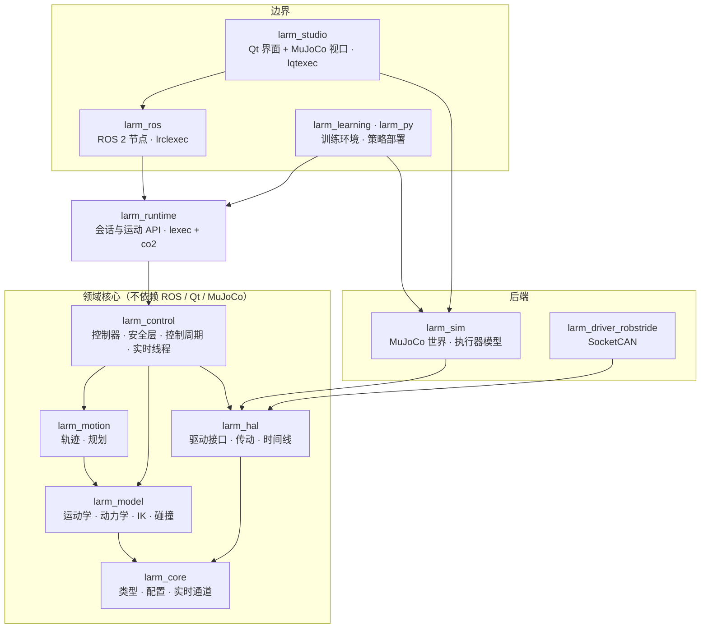
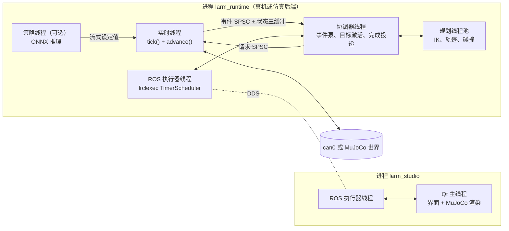
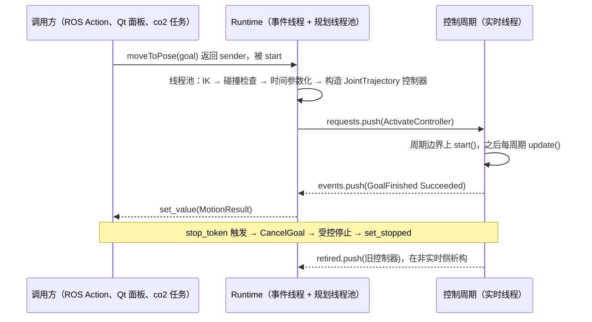

# lrebot_arm 架构设计

状态：草案 v0.1（2026-10-02）。本文给出通用机械臂框架（暂名 `larm`）的整体架构与模块设计，第一个落地机器人是 reBot Arm B601-RS。

## 1 目标与范围

- 一套与具体机械臂无关的控制框架：同一份模型、轨迹、控制器和安全层，既能接真机，也能接 MuJoCo 仿真，还能放进训练环境批量运行。
- 系统集成采用 ROS 2：对外用标准话题、Action、服务，能接 RViz、MoveIt、rosbag2。
- 用 MuJoCo + Qt 完成仿真、可视化操控和训练。
- 非实时编排统一用 sender/receiver：lrclexec 接 ROS 2，lqtexec 接 Qt；多步流程用 co2 协程书写。

不在范围内：电机 ID 写入、零点标定、参数模板写入（继续使用 MotorBridge Studio）；功能安全认证；真实相机驱动（用现有 ROS 驱动）。

## 2 已核实的约束

### 2.1 reBot B601-RS

来源：Seeed wiki、`~/rebot_env/reBotArm_control_py` 中的 `config/rebotarm_rs.yaml`、RS URDF、`docs/gravity_calibration_rs_2026-07-17.md`。

| 项 | 事实 |
|---|---|
| 关节 | joint1–6 为旋转关节；夹爪 1 个电机，URDF 中是两个直线指关节（joint_left 0–0.05 m，joint_right 0–0.0715 m，两者上限不一致，需要核对） |
| 位置限位 | J1 ±2.8，J2 0–3.14，J3 0–3.14，J4 ±1.57，J5 ±1.57，J6 ±3.14（rad） |
| 电机 | RobStride：J1–J3 为 RS-06（URDF 力矩上限 36 N·m），J4–J6 与夹爪为 RS-00（14 N·m）；ID 0x01–0x07，主机 ID 0xFD |
| 总线 | PCAN-USB → SocketCAN `can0`，1 Mbit/s；48 V 供电 |
| 电机模式 | MIT（位置、速度、kp、kd、前馈力矩）、POS_VEL（电机内部位置环，依赖写入的参数模板）、VEL |
| 现用 MIT 增益 kp/kd | J1 50/3，J2–J3 150/10，J4 50/5，J5–J6 50/4，夹爪 50/4 |
| 动力学 | 按 URDF 质量计算的重力模型误差 5–11%；电机零点与 URDF 零点一致，q=0 为伸展的停放姿态，此时夹爪触桌；各关节库仑摩擦 0.2–0.5 N·m，腕部摩擦与重力同量级 |
| 反馈 | 旧 Python 路径中 RS 固件的缓存位置曾冻结（主动上报帧未被解码）；参数 0x701A 读出的速度不是 rad/s，速度要对位置差分 |
| URDF 限速 | 40–50 rad/s，不能直接作为安全限值 |

总线预算：MIT 模式下每个电机每周期一条命令帧和一条应答帧，7 个电机共 14 帧。8 字节扩展帧约 131–155 bit（含位填充），1 Mbit/s 下每周期约 1.8–2.2 ms。500 Hz（2 ms）已接近或超过总线容量。默认控制频率定为 250 Hz（约 50% 总线负载），用 `canbusload` 实测后再调整；夹爪可以降频发送。

### 2.2 软件环境（本机）

Ubuntu 24.04、GCC 13.3、ROS 2 Jazzy。Jazzy 软件包：Pinocchio 4.1.0、Coal 3.0.3、Ruckig 0.9.2、ros2_control 4.48、MoveIt 2.12.4、tl-expected。Qt 6.8.3（`~/Qt`）与系统 Qt 5.15.13。MuJoCo 使用官方 3.8.0 发布包，由 `tools/fetch_mujoco.sh` 按固定哈希下载到 `.deps/`（不入库）。ROS 的 `tl_expected` 包已标记弃用，改用系统的 `libexpected-dev`。官方 Qt 6.5 起的 xcb 平台插件依赖 `libxcb-cursor0`，本机未安装，在 X11 下运行 Studio 前需要 `sudo apt install libxcb-cursor0`。

### 2.3 自有库

- **lexec**：C++17 sender/receiver。含 `when_any`、`repeat`、`counting_scope`、`static_thread_pool`、`run_loop`、`any_sender_of`（connect 时分配一次）、co2 桥 `lexec/coro/co2.hpp`（需要异常）。
- **lrclexec**：ROS 2 执行器作调度器（`TimerScheduler`，支持 LifecycleNode 与 `/clock`）；`execute_action`、`call_service`、`wait_message`；抢占式 Action 服务端 `make_action_server_preempt`（先排空旧任务再启动新任务）；`spin_with_scope`、`SignalStop`。
- **lqtexec**：Qt 事件循环作调度器；`wait_signal`、`SignalChannel`；`ObjectScope`（工作随 QObject 生命周期收束）；`ThreadPoolScheduler`；`exec_with_scope`。
- **co2**：C++14 宏实现的无栈协程，`Task`、`Generator`、`AsyncGenerator`、`stop_token`；经 lexec 桥可直接 `CO2_AWAIT` 一个 sender。

本次验证：lexec + co2 桥在 `-std=c++20` 下编译运行通过；C++20 下 lexec 默认引入 `<execution>`，随之引入 TBB，而 TBB 头文件与 Qt 的 `emit` 宏冲突。larm 不使用标准执行策略，因此在 `lexec::lexec` 目标上定义 `LEXEC_NO_STD_EXECUTION_POLICY`，所有使用者（包括 lrclexec、lqtexec）看到同一份配置；Studio 另外定义 `QT_NO_KEYWORDS`。lrclexec 与 lqtexec 都接受父工程提供的 `lexec::lexec`，整个程序只能有一个 lexec 提供者。`~/code/lockfree/fastqueue` 是按需分配节点的 MPMC 队列，不满足实时线程零分配的要求，不用于实时边界。

## 3 设计原则

*Scaling Robotics to 200 Developers*（CppCon 2026）给出的接口目标：稳定（接口长期不变）、高性能（热路径不分配，由调用方提供缓冲区）、可扩展（运动学、碰撞、物理后端可替换）、可读的现代 C++ 并带 Python 绑定；规划、控制、仿真尽量共用同一套类型；算法与类型分离。

本设计在此之上补充三条：

1. **控制代码只有一份。** 控制器与安全层不知道自己面对的是真机、交互仿真还是训练环境。差别只在硬件抽象和"谁拥有时间"。
2. **实时与非实时用类型隔开。** 实时线程只拿得到标注为实时安全的接口，不分配、不加锁、不用协程和 sender。可阻塞、可分配的工作在非实时侧完成，以不可变对象交给实时侧。
3. **核心不依赖 ROS、Qt、MuJoCo。** 三者只出现在边界模块。训练机器不装 ROS 和 Qt 也能构建核心、仿真与训练模块。

## 4 总体架构

### 4.1 组件



| 组件 | 职责 |
|---|---|
| Model | 机器人是什么：描述加载、正逆运动学、动力学、碰撞 |
| Motion | 怎么走：轨迹类型、轨迹生成、关节与笛卡尔规划 |
| Control | 这一周期输出什么：控制器、安全过滤、单周期步进函数、实时线程 |
| HAL | 机器人的身体：驱动接口、执行器与关节之间的传动换算、时间线 |
| Simulation | MuJoCo 世界、执行器模型、仿真传感器、参数随机化 |
| Runtime | 非实时编排：把实时内核包装成 sender 接口，负责规划卸载、事件泵、会话 |
| 边界 | ROS 2 集成、Qt 人机界面、训练与策略部署 |

划分理由：Model、Motion、Control 对应演讲中的运动学/动力学、轨迹/规划、控制三块，碰撞检查并入 Model。HAL 单独成模块，是为了让驱动只依赖接口、不依赖控制器。Simulation 同时服务于 HAL 后端、Studio 渲染和训练三方，所以独立。Runtime 与 ROS 分开，让 Studio、训练部署和测试可以在没有 ROS 的情况下使用同一套编排逻辑。

### 4.2 依赖规则

由 CMake 目标图强制：

- 依赖只能向下：边界 → Runtime → Control → Motion → Model → Core；Control、Simulation、驱动 → HAL → Core。
- `rclcpp` 只出现在 `larm_ros`、`larm_studio` 的 ROS 客户端部分和 `larm_msgs`；Qt 只在 `larm_studio`；MuJoCo 只在 `larm_sim` 与 Studio 视口；Pinocchio、Coal、Ruckig 只出现在实现文件中，公开头文件看不到它们。
- 只有组合根（各可执行文件的 `main`）选择具体实现并完成装配。

### 4.3 时间归属与运行模式

控制周期本身是一个纯步进函数（`ControlCycle::tick()`），推进时间的职责交给注入的 `Timeline`：

| 模式 | 时间所有者 | 推进方式 | `/clock` |
|---|---|---|---|
| 真机 | 单调时钟 | 实时线程睡到下一个绝对截止时刻 | 不发布，各节点用墙钟 |
| 交互仿真 | 仿真时间 | 实时线程推进一个控制周期的物理子步，再按实时倍率节流 | 由运行时节点发布 |
| 快速仿真（CI） | 仿真时间 | 同上，不节流 | 由运行时节点发布 |
| 训练 | `step()` 的调用方 | 训练循环直接调用 `tick()` 与 `advance()` | 无 |
| 镜像 | 真机 | Studio 只显示真机关节状态，不做物理 | 不涉及 |

MuJoCo 与控制周期在同一进程、同一线程中锁步，物理推进的关键链上没有 DDS、TCP 或渲染。运行时节点自己的定时器使用稳态时钟，不依赖自己发布的 `/clock`。

### 4.4 进程与线程



| 线程 | 运行内容 | 约束 |
|---|---|---|
| 实时线程 | `tick()` → `advance()` | 真机下 SCHED_FIFO、绑核、`mlockall`；不分配、不加锁、不进 ROS |
| 协调器线程 | 排空实时事件、激活等待中的目标、投递 sender 完成 | 每 2 ms 轮询一次；完成延迟不超过一个轮询周期，实时侧不需要额外的唤醒系统调用 |
| 规划线程池 | lexec `static_thread_pool`，执行 IK、轨迹生成、碰撞检查 | 只做纯计算 |
| ROS 执行器线程 | `SingleThreadedExecutor` + lrclexec | 不阻塞；sender 完成后经 `continues_on` 回到这里 |
| 策略线程 | 按策略频率推理，写流式设定值 | 只在部署策略时存在 |
| Qt 主线程 | 界面、MuJoCo 渲染 | 渲染读取状态快照，使用独立的 `mjData` |

真机部署时另有 `robot_state_publisher`（由 `/joint_states` 与 URDF 发布 TF）；需要时启动 MoveIt `move_group`，通过 FollowJointTrajectory 驱动运行时。

### 4.5 三个库的位置

| 库 | 用在哪里 | 做什么 |
|---|---|---|
| lexec | Runtime | 运动 API 返回类型擦除的 sender；规划卸载到线程池；`when_any` 做超时；`counting_scope` 管理任务生命周期 |
| lrclexec | larm_ros | 运行时节点的 Action 服务端（抢占语义）、状态发布循环、`spin_with_scope` + `SignalStop` 收束；Studio 侧的远程会话用 `execute_action` / `call_service`，Studio 的 ROS 线程用 `spin_with_scope` |
| lqtexec | larm_studio | 面板操作的结果经 `then_on(ObjectScope, …)` 回 GUI 线程；面板持有 `ObjectScope`（面板关闭即停止它发起的运动）；停止按钮用 `wait_signal` 与操作 `when_any` 竞争；`SignalStop` + `exec_with_scope` 收束 |
| co2 | 任务层 | 多步流程（抓放、标定例程、数据采集）、长循环；`CO2_AWAIT` 运动 API 返回的 sender |

实时线程内不使用其中任何一个。

## 5 核心契约

示意代码遵循项目 C++ 风格：`struct` 关键字、east const、指定初始化器、抽象接口 + 工厂函数、数据类只含公开字段。C++ 标准为 C++20（需要 `std::span` 与指定初始化器；lexec、co2 已验证可用）；非实时错误用 `larm::Expected<T>`（先别名到 `tl::expected`）。

### 5.1 数据类型

```cpp
namespace larm {

inline constexpr std::size_t kMaxDof = 16;
// 定容向量：运行期长度可变，存储在栈上，不分配
using JointVector = Eigen::Matrix<double, Eigen::Dynamic, 1, Eigen::ColMajor, kMaxDof, 1>;
using JointMask = std::bitset<kMaxDof>;

struct JointState {
    JointVector position;
    JointVector velocity;
    JointVector effort;
};

// 关节阻抗指令，MIT 协议的超集：tau = kp(q* - q) + kd(dq* - dq) + tau_ff
struct JointCommand {
    JointVector position;
    JointVector velocity;
    JointVector effort;
    JointVector stiffness;
    JointVector damping;
};

struct ActuatorStatus {
    bool enabled{};
    std::uint32_t faultBits{};
    float temperature{};
};

struct RobotState {
    std::uint64_t cycle{};
    TimePoint stamp{};
    JointState joints;
    std::array<ActuatorStatus, kMaxDof> actuators{};
    bool isFresh{};   // 本周期所有关节反馈齐全且未超时
};

}
```

关节空间指控制空间，包含 reBot 的 6 个臂关节和 1 个夹爪关节（单位为米的开口宽度）。驱动可以工作在执行器空间，由传动适配器换算。

### 5.2 硬件抽象

```cpp
namespace larm::hal {

enum class CommandMode : std::uint8_t { Position, Velocity, Effort, Impedance };
enum class DrivePower : std::uint8_t { Disabled, Enabled };

struct DriverCapabilities {
    std::bitset<4> modes;               // 以 CommandMode 为下标
    std::chrono::nanoseconds minPeriod{};
    bool hasBrakes{};
};

// 只在实时线程调用：不分配、不加锁、耗时有界
struct RealtimeIo {
    virtual ~RealtimeIo() = default;
    virtual void read(RobotState &out) noexcept = 0;
    // 使能/失能也经由实时线程，保证总线只有一个写者；实际状态从 read() 返回
    virtual void write(JointCommand const &command, DrivePower requested) noexcept = 0;
};

// 时间所有者：真机睡到下个周期；仿真推进物理并按策略节流
struct Timeline {
    virtual ~Timeline() = default;
    virtual TimePoint now() const noexcept = 0;
    virtual void advance() noexcept = 0;
};

// 非实时生命周期，可阻塞
struct RobotDriver {
    virtual ~RobotDriver() = default;
    virtual DriverCapabilities capabilities() const = 0;
    virtual Expected<void> connect() = 0;   // 打开总线，确认电机在线、参数与期望一致；电机保持失能
    virtual void disconnect() noexcept = 0;
    virtual RealtimeIo &io() = 0;
};

// 一个驱动及驱动它的时间线。仿真后端在此之上提供 reset() 与 MuJoCo 状态访问。
struct Backend {
    virtual ~Backend() = default;
    virtual RobotDriver &driver() = 0;
    virtual Timeline &timeline() = 0;
};

}
```

后续加入：驱动注册表（配置中的 `driver.type` 选择工厂）与执行器空间到关节空间的传动适配器，随第 4 步的真机驱动实现；在此之前运行时节点只有 `mujoco` 后端。

### 5.3 控制器与控制周期

控制器实例在非实时侧构造，目标（轨迹、夹爪宽度、流式邮箱指针）在构造时放入，所需内存在构造时分配。实时侧只做切换和调用，从不构造、析构控制器。

```cpp
namespace larm::control {

enum class ControlStatus : std::uint8_t { Running, Succeeded, Stopped, Failed };

struct ControlStep {
    ControlStatus status{};
    FaultCode fault{};
};

struct ControlContext {
    TimePoint now;
    Duration period;
    RobotState const &state;
    ModelCache const &model;   // 本周期已算好的 FK、雅可比、重力力矩，控制器与安全层共用
};

struct Controller {
    virtual ~Controller() = default;
    virtual JointMask claims() const noexcept = 0;       // 占用的关节；同时激活的控制器必须互不相交
    virtual ControlStep start(ControlContext const &ctx) noexcept = 0;   // 从当前状态无扰接管
    virtual ControlStep update(ControlContext const &ctx, JointCommand &out) noexcept = 0;   // 只写 claims() 内的关节
    virtual void requestStop() noexcept = 0;             // 受控减速，之后以 Stopped 结束
};

// 一个控制周期：read → 处理请求 → 更新模型缓存 → 各控制器 → 安全层 → write → 发布快照与事件
struct ControlCycle {
    virtual ~ControlCycle() = default;
    virtual void tick() noexcept = 0;
};

// 驱动必须支持阻抗指令：所有控制器都输出 JointCommand
Expected<std::unique_ptr<ControlCycle>> makeControlCycle(RobotProfile const &profile, ControlCycleDeps const &deps);

}
```

没有被任何控制器占用的关节由控制周期内置的保持逻辑填充，保证每个关节每周期都有指令。内置控制器：

| 控制器 | 用途 |
|---|---|
| Hold | 保持当前位置 + 重力补偿；默认控制器，也是故障反应 |
| JointTrajectory | 跟踪不可变轨迹，前馈重力或逆动力学；路径/终点容差监控；受控停止用 Ruckig 生成减速段 |
| JointStream | 流式关节目标（遥操作、策略输出），插值，超时即停 |
| CartesianServo | 末端速度 → 阻尼最小二乘微分 IK，带关节限位回避，超时即停 |
| Gripper | 宽度 + 力矩上限，检测堵转判定抓住 |
| GravityComp | 零刚度、小阻尼 + 重力前馈；用于拖动示教 |

安全层位于控制器之后、`write` 之前，按顺序执行：指令完整性 → 位置软限位 → 速度与加速度限幅 → 刚度、阻尼、力矩限幅 → 反馈新鲜度检查。故障分两类：目标级故障（流式输入超时、跟踪误差超限）只终止该目标，转入 Hold；系统级故障（某关节反馈丢失、电机故障码、越过硬限位）锁存，所有关节转入 Hold，必须显式复位。

使能流程也在实时线程内完成：`DrivePower::Enabled` 请求发出后，Hold 控制器以当前位置为目标，刚度在设定时间内从 0 爬升到标称值。

### 5.4 实时与非实时边界

```cpp
namespace larm::control {

struct ActivateController { GoalId goal; JointGroupId group; std::unique_ptr<Controller> controller; };
struct CancelGoal { GoalId goal; };
struct SetDrivePower { hal::DrivePower power; };
struct EmergencyStop {};
struct ResetFault {};
using ControlRequest = std::variant<ActivateController, CancelGoal, SetDrivePower, EmergencyStop, ResetFault>;

struct GoalFinished { GoalId goal; ControlStatus status; FaultCode fault; };
struct SafetyChanged { SafetyState state; FaultCode cause; };
struct PowerChanged { hal::DrivePower power; };
using ControlEvent = std::variant<GoalFinished, SafetyChanged, PowerChanged>;

struct RuntimeChannels {
    rt::SpscRing<ControlRequest, 64> requests;                // 非实时 → 实时
    rt::SpscRing<ControlEvent, 256> events;                   // 实时 → 非实时
    rt::SpscRing<std::unique_ptr<Controller>, 64> retired;    // 被替换的控制器退回非实时侧析构
    rt::LatestValue<RobotSnapshot> snapshot;                  // 三缓冲：状态、本周期指令、活动控制器、安全状态
    rt::SpscRing<CycleTelemetry, 4096> telemetry;             // 每周期计时与跟踪误差，供记录
};

}
```

`SpscRing`（定容、无分配、wait-free）和 `LatestValue`（三缓冲，写端从不阻塞）放在 `larm_core` 中，单元测试在 TSan 下运行。流式输入（遥操作、策略）各自持有一个 `LatestValue<StreamTarget>`，非实时侧写入，对应控制器读取。

一次运动的完整路径：



### 5.5 会话与运动 API

这是框架对上层的稳定接口。本地实现在 `larm_runtime`，远程实现（经 ROS 2）在 `larm_ros`；Studio、co2 任务、测试只依赖接口，不区分本地还是远程。

```cpp
namespace larm::runtime {

template <class... Values>
using Async = lexec::any_sender_of<lexec::set_value_t(Values...),
                                   lexec::set_error_t(std::exception_ptr),
                                   lexec::set_stopped_t()>;

struct MotionApi {   // 一个带工具帧的关节组
    virtual ~MotionApi() = default;
    virtual Async<MotionResult> moveToJoints(JointGoal goal) = 0;
    virtual Async<MotionResult> moveToPose(PoseGoal goal) = 0;
    virtual Async<MotionResult> followPath(JointPath path) = 0;   // 带时间的路点；首点晚于 0 时从当前位置出发
};

struct GripperApi {   // 单关节组
    virtual ~GripperApi() = default;
    virtual Async<GripResult> grip(GripGoal goal) = 0;
};

struct RobotSession {
    virtual ~RobotSession() = default;
    virtual RobotProfile const &profile() const noexcept = 0;
    virtual Async<> enable() = 0;
    virtual Async<> disable(DisableOptions options) = 0;   // 不在停放姿态时拒绝，除非 force
    virtual Async<MotionResult> park() = 0;                // 回到停放姿态
    virtual Async<> resetFault() = 0;
    virtual void emergencyStop() noexcept = 0;
    virtual control::RobotSnapshot latest() const = 0;
    virtual MotionApi *motion(std::string_view group) = 0;   // 取一次句柄，之后直接调用
    virtual GripperApi *gripper(std::string_view group) = 0;
};

}
```

失败统一以 `MotionError{reason, fault}` 报告，`reason` 区分无效目标、不可达、规划失败、未使能、故障、超时、关闭。流式会话（遥操作、策略）随第 3、5 步加入。

语义：

- 完成发生在运行时的协调器线程（远程实现中为 ROS 执行器线程），调用方用 `continues_on` 回到自己的上下文。
- 停止请求映射为受控停止，以 `set_stopped` 完成；规划失败、跟踪超差、系统故障以 `set_error(MotionError)` 完成。
- 同一关节组的新目标抢占旧目标：旧目标受控停止并以 stopped 完成，新目标从停稳状态开始。这与 lrclexec 抢占式 Action 服务端的语义一致。

### 5.6 任务层

```cpp
auto pickAndPlace(larm::RobotSession *robot, larm::Pose3 pick, larm::Pose3 place)
    CO2_BEG(co2::Task<>, (robot, pick, place), larm::MotionApi *arm{}; larm::GripperApi *hand{};) {
    arm = robot->motion(kArm);
    hand = robot->gripper(kGripper);
    CO2_AWAIT(hand->grip({.width = 0.05}));
    CO2_AWAIT(arm->moveToPose({.target = above(pick)}));
    CO2_AWAIT(arm->moveToPose({.target = pick, .path = PathKind::Linear}));
    CO2_AWAIT(hand->grip({.width = 0.0, .maxEffort = 5.0}));
    CO2_AWAIT(arm->moveToPose({.target = above(place)}));
}
CO2_END
```

任务取消时，co2 的 `stop_token` 经桥传给正在等待的 sender，最终变成实时侧的受控停止。

## 6 模块设计

每个模块对应一个 CMake 目标，命名空间为 `larm::<模块>`，头文件为 `<larm/<模块>/Foo.h>`。

### 6.1 larm_core

- 职责：基础类型（5.1）、`Pose3`、`Twist`、`Wrench`；时间类型；错误类型；机器人配置；实时原语 `SpscRing`、`LatestValue`。
- 机器人配置 `RobotProfile`：关节（名称、单位、限位、默认增益）、关节组（成员、基座帧、工具帧）、控制周期、安全参数、停放姿态、描述文件路径；`driver` 与 `sim` 段原样交给对应工厂解析。配置从 YAML 加载并在加载时校验，未知键报错。ROS 参数只用来指定配置文件和后端，不重复配置内容，这样训练环境不需要 ROS 也能读同一份配置。
- 依赖：Eigen、yaml-cpp、tl-expected。
- 验证：单元测试（配置解析与校验；实时原语在 TSan 下的并发测试）。

### 6.2 larm_model

- 职责：从 URDF 构建模型，提供运动学、动力学、逆解、碰撞检查。
- 接口：
  - `Kinematics`：`frame(name) -> optional<FrameId>`（冷路径，取一次 ID）；`update(q)`；`framePose(FrameId)`；`frameJacobian(FrameId, Eigen::Ref<Matrix6X>)`。按名字查询只在初始化时发生。
  - `Dynamics`：`gravity(q, out)`、`inverseDynamics(q, dq, ddq, out)`、`massMatrix(q, out)`；结果写入调用方的缓冲区，不分配。
  - `IkSolver`：`solve(IkRequest const &, std::span<double const> seed, IkSolution &out) -> IkStatus`；首个实现为带关节限位的 Levenberg–Marquardt，多初值。
  - `CollisionChecker`（已实现自碰撞，环境基本体待加）：`allowContactsAt(q)` 记下起点已有的接触深度，`collision(q)` 返回比允许深度再深 1 mm 以上的第一对连杆。这样运动可以离开静止接触（折叠的手臂靠在自己身上），但不能压得更深，也不能产生新的接触。用于规划阶段校验轨迹。
- 实现：Pinocchio（运动学、动力学）与 Coal（碰撞），隐藏在工厂函数后面。臂的模型由 URDF 去掉夹爪关节后得到。动力学参数可由配置覆盖 URDF 惯性参数。
- 碰撞几何：完整 URDF（mimic 关节跟随主动关节，两指一起开合）上的碰撞网格，一个连杆可以有多个。网格必须是凸的，加载时校验，再转成 Coal 的凸体，用 GJK/EPA 求带符号距离（先用各凸体的世界轴对齐包围盒剔除分开的对）。不检查的连杆对：连杆树中相邻的连杆，以及配置中 `description.srdf` 列出的 `disable_collisions`。reBot 的 71 个凸体下，Release 每个构型约 35 µs（停放姿态附近）到 70 µs（随机构型）。
- 验证：雅可比与数值差分对比；Pinocchio 与 MuJoCo 在随机构型下的 FK 一致性测试（同时检查 URDF 与 MJCF 是否一致）；自碰撞：停放姿态无碰撞（夹爪开合皆然），腕部下压、折叠手臂翻向底座判为碰撞，允许的接触可以保持、不能加深。

### 6.3 larm_motion

- 职责：轨迹类型、轨迹生成、规划。
- 接口：`JointTrajectory`：`duration()`、`sample(t, JointSample &out) const noexcept`（位置、速度、加速度）；对象不可变，实时侧求值不分配。
- 实现：`RuckigTrajectory`（多关节同步、限加加速度的点到点）；`WaypointTrajectory`（多路点 + 时间参数化）；笛卡尔直线在非实时侧用 IK 稠密采样转成关节轨迹。
  - `WaypointTrajectory` 中路点未给出的速度由相邻路点求出，并按 Fritsch–Carlson 条件限幅：关节在路点处转向或停顿时速度取 0。这样每段都落在两端路点之间，路点不超限，路径就不超限。否则，以当前位置作为第一个路点时，第一段会先反向冲出去，在限位上的关节会被带出限位。
- `findCollision(trajectory, checker, step)`：从轨迹起点允许已有接触，按每个关节的最大步长（转动关节 0.02 rad，夹爪 2 mm）采样整条轨迹做自碰撞检查，返回第一次碰撞的连杆对与时刻。
- `MotionPlanner`（非实时）：目标 → IK → 碰撞检查 → 时间参数化 → `JointTrajectory`。全局避障规划需要时交给 MoveIt，MoveIt 输出经 FollowJointTrajectory 回到本框架执行。
- 验证：限值（速度、加速度、加加速度）、端点、连续性的单元测试；路径不越过相邻路点；轨迹扫描的步长、首次碰撞与短运动终点。

### 6.4 larm_hal

- 职责：5.2 中的接口；`MonotonicTimeline`（`clock_nanosleep` 绝对时刻，记录错过的周期）；`IdealBackend`（关节每周期精确到达指令位置，可注入反馈丢失），用于控制层测试。
- 传动（方向、零点偏置、线性比例，含夹爪的弧度 ↔ 米）没有做成 HAL 层的通用表，而是作为每个执行器的驱动配置，由驱动在收发时换算（6.7）。目前只有 RobStride 驱动需要它，等有第二个驱动时再上提。
- 验证：`MonotonicTimeline` 与 `IdealBackend` 的单元测试；传动换算的测试在驱动里（含刚度、阻尼按比例平方换算）。

### 6.5 larm_control

- 职责：5.3、5.4 中的控制器、安全层、`ControlCycle`；`RealtimeRunner`（RAII：构造时建线程并设置调度策略、绑核、锁内存，析构时停止并 join，统计唤醒延迟和超时周期）。
- 每周期的模型缓存：`ModelCache` 在每周期用当前 `q` 更新一次（FK、工具帧雅可比、重力力矩），控制器与安全层共用。
- 执行器掉线（第 4 步加入）：已使能时某个执行器自行退出运行（电机故障等），控制周期报 `ActuatorFault`、中止所有目标，其余执行器以完整保持刚度加重力补偿停在当前位置（Degraded 阶段，对外报告为未使能），直到请求失能。机械臂没有抱闸，这比让其余关节一起松掉更安全。恢复步骤：失能（不在停放姿态时用强制失能）→ 复位故障 → 重新使能；重新使能时驱动先清除电机锁存的故障。
- `makeControlCycle` 拒绝短于驱动 `minPeriod` 的控制周期，`minPeriod` 由驱动按总线流量给出。
- 验证：在 `IdealBackend` 和 MuJoCo 后端上的确定性测试：轨迹跟踪误差在界内、限位与限幅生效、取消时平滑减速、故障锁存与复位、控制器占用冲突被拒绝；替换 `malloc` 的测试保证运行中的控制周期不做堆分配。

### 6.6 larm_sim

- 职责：MuJoCo 后端。
- `MujocoWorld`：持有 `mjModel` 与 `mjData`，按配置把关节名、执行器名绑定到 MuJoCo ID，加载场景物体。不做模型随机化时，多个世界共享同一个只读 `mjModel`；做随机化时每个世界持有自己的模型副本。
- `ActuatorModel`：把 `JointCommand` 转成关节力矩，在每个物理子步计算 MIT 律、力矩饱和、可选的指令延迟和量化。MJCF 中执行器为力矩型 `motor`。
- `SimulatedRobot`：实现 `RobotDriver`、`RealtimeIo` 和仿真 `Timeline`。`advance()` 执行一个控制周期内的全部物理子步（默认物理步长 0.5 ms，控制周期 4 ms 时为 8 步），节流策略为"按实时倍率"或"不节流"。失能时力矩为 0，可以在仿真中验证掉臂与安全反应；机器人连杆之间有接触（第 7 节），所以停放姿态下失能时手臂与实物一样保持折叠。
- `SceneMirror`（第 3 步实现）：Studio 侧的显示用世界，持有自己的 `mjModel` 与 `mjData`，不做物理。把配置关节的位置写入 `qpos`，按 MJCF 中 `equality joint` 的多项式补出耦合关节（`joint_right`），再 `mj_forward`。机器人姿态由 `/joint_states` 即可还原；整个世界的 `qpos` 快照留到场景中有可动物体时再加入。
- 相机：离屏渲染（EGL）在独立线程中进行，用自己的 `mjData` 副本。
- 随机化 `Randomizer`：在 reset 时扰动质量与质心、关节摩擦、增益、延迟、传感器噪声；默认范围参考重力标定结果（质量 ±10%，库仑摩擦 0.2–0.5 N·m）。
- 风险：显式计算的阻尼项 kd 在小惯量腕关节上可能要求更小的物理步长。需要按最小等效惯量验证稳定性；不稳定时改用 MuJoCo 执行器 + `implicitfast` 积分器隐式处理阻尼。

### 6.7 larm_can 与 larm_robstride（第 4 步，离线部分已实现）

- 职责：通过 SocketCAN 直接驱动 RobStride 电机的 `RobotDriver`。分两个目标：`larm_can`（`drivers/can`，与厂商无关）与 `larm_robstride`（`drivers/robstride`）。
- `CanTransport`：非阻塞批量收发（`sendmmsg` / `recvmmsg`，缓冲预分配，实时线程可调用），错误帧只计数，并记录 bus-off；另有一个用于非实时代码的阻塞等待。`openSocketCan(interface)` 打开原始套接字；错误信息都带接口名。
- 编解码 `Codec`：纯函数，覆盖私有协议的运控（类型 1）、反馈（类型 2，以及主动上报类型 24）、使能（3）、失能（4，可清故障）、ping（0）、参数读（17）、参数写（18）、故障上报（21）、主动上报开关（24）。数值按手册把 [-max, max] 线性映射到 [0, 65535]，取最近整数。另有电机侧的 `encodeStatus` / `decodeMotion`，供模拟电机与测试使用。核对依据：
  - RobStride RS-00、RS-06 手册的帧格式。
  - motorbridge 项目的实现，及其实机抓到的固件版本应答。版本应答与反馈帧类型相同，按负载特征排除。
  - 量程：RS-00 为 ±4π rad、±33 rad/s、±14 N·m、Kp 0–500、Kd 0–5；RS-06 为 ±4π、±50、±36、0–5000、0–100。RS-06 手册的运控帧表写的是 ±120 N·m、Kp 0–500、Kd 0–5，与同一份手册的反馈帧表（±36 N·m）以及 motorbridge、robstride_ros2 都不一致，判断为抄写错误；实机使能保持阶段要验证前馈力矩的量程。
  - 旧固件的 Kp/Kd 有 1.4167 倍的换算错误（RobStride 固件更新说明），上真机前用 MotorBridge Studio 确认固件版本。
- `DriverConfig`：解析配置的 `driver` 段，拒绝未知键，内容包括：
  - 接口名、主机 ID、执行器列表（关节、CAN ID、型号、传动 `scale` / `offset`）；
  - 是否关闭主动上报、可选的电机侧 CAN 超时、总线比特率。
  - 解析时检查：每个关节恰有一个执行器、ID 不重复且不等于主机 ID；关节限位、速度、力矩、刚度、阻尼按传动换算到电机侧后不超出编码量程。
- `RobStrideDriver`：每个执行器每周期发一帧，并在下次 `read()` 前收到一帧应答。各执行器的状态：
  - 未使能（Idle）：用参数读（机械位置 0x7019）轮询，不发失能帧。因此另一个程序留在运行状态的电机不会被意外失能，机械臂不会因此落下。
  - 请求使能的上升沿：有锁存故障的电机先发带清除标志的失能帧，再发使能帧，直到反馈显示运行模式。
  - 运行中发运控帧（关节量经传动换算）。
  - 请求失能时发失能帧，直到反馈显示已退出运行，再回到参数读轮询。
  - 自行退出运行的电机不会自动重新使能，直到下一次请求使能。
  - `read()` 排空接收队列，按 ID 与目的地址过滤外来帧，缺少应答时反馈标记为不新鲜。
  - `connect()` 逐个 ping、读 `run_mode`（须为 0）与 `zero_sta`（须为 1，即上电位置落在 -π..π），按配置关闭主动上报、写 CAN 超时；不改变电源状态。`disconnect()` 不发任何帧，电机保持最后一条指令。
  - `capabilities().minPeriod` 等于一个周期的总线时间：7 个执行器 14 帧，1 Mbit/s 下约 2.17 ms。
- 后端：`makeRobStrideBackend(profile)` 组合 SocketCAN、驱动与单调时间线；`makeSimulatedRobStrideBackend(profile, options)` 把同一个驱动接到模拟电机上。
- 模拟电机 `SimulatedMotors`：进程内总线，按 MIT 律积分每个电机，可通过 `jointSpaceLoad` 加上关节空间负载（例如机械臂的重力）。支持注入故障、静默某个电机、改 `run_mode`。构造后不分配内存，带锁，可以一边被控制线程使用、一边被另一线程查看。
- 速度：先用反馈帧中的速度。探针同时记录参数 0x701B 的速度和位置差分，供实机比对。reBotArm_control_py 记录中说"速度参数不是 rad/s"，而它读的 0x701A 在参数表里是滤波电流，并不是速度。
- 安全取舍：
  - 电机侧 CAN 超时默认不写。该机械臂没有抱闸，超时后电机进入复位模式，机械臂会落下；不写时主机崩溃后电机保持最后一条指令。是否启用待真机阶段决定。
  - 运行时停止时如果仍在使能，电机保持最后一条指令。因此停止运行时之前应先停放、失能。
- MotorBridge 不进入运行时路径，继续用于电机初始化（ID、零点、固件）与交叉核对。
- 验证：
  - 编解码按手册布局逐字节测试，包括实机抓到的版本应答。
  - 配置解析测试。
  - 驱动在模拟电机上的测试：connect 检查、失能时只读轮询、使能与跟踪、夹爪传动、故障电机不自动恢复、应答缺失、`minPeriod`。
  - 带重力负载的整栈运行时测试：使能、运动、夹取、停放、失能；单个执行器故障时其余保持；周期短于总线时间被拒绝。
  - 零堆分配测试加入 RobStride 后端。
  - `vcan0` 上的 SocketCAN 收发测试，没有该接口时跳过。

### 6.8 larm_runtime

- 职责：5.5 中 `RobotSession`、`MotionApi`、`GripperApi` 的本地实现，入口为 `startLocalRuntime(profile, backend, options)`。
- 组成：
  - 本地会话：持有后端、模型、`ControlCycle`、`RealtimeRunner`、协调器和规划线程池（lexec `static_thread_pool`）。析构顺序为停实时线程 → 关协调器（仍在进行的操作以 `Shutdown` 失败）→ 释放线程池。
  - 规划：IK、目标校验在线程池上完成；不合法的目标在这里以 `MotionError` 拒绝。关节目标和路点超出限位不超过 `safety.limit_tolerance` 时夹到限位上，因为停在限位上的关节实测值可能略微越过限位，而实测值本身就是合理的目标（例如路径面板的"添加当前位置"）；超出更多时拒绝，并报出关节、目标值与限位。
  - 协调器：唯一的实时请求生产者（加锁串行化多个调用线程）。每 2 ms 排空实时事件，按关节重叠处理抢占：运行中的旧目标先受控停止，尚在等待的旧目标直接以 stopped 结束。控制器在激活时才由 `ControllerFactory` 按当时的指令状态构造，所以被抢占后会从停稳的位置重新规划。
  - 自碰撞：点到点、路径与停放的轨迹在激活时生成后，用 `findCollision` 整条检查；会碰撞时目标以 `planning_failed` 失败，报出连杆对、重叠深度和时刻，机械臂不动。检查在协调器的锁内进行（一段 2 rad 的运动约 100 次查询、几毫秒），所以检查器只有一个，由各工厂共用。
  - 停放是关节空间的直线式运动，不绕行。腕部偏航较大、小臂又折叠时，直接回停放姿态会让腕部擦过大臂（实物网格同样如此），停放以 `planning_failed` 拒绝，需要先抬起小臂再停放。在停放姿态附近的随机构型中约有 1.5%–3.5% 属于这种情况；能自动绕行的规划留待以后。
  - sender：`GoalSender`、`WaitSender` 的操作状态由 `shared_ptr` 持有，接收者只取一次；停止回调只登记取消，所有完成都在协调器线程上投递。
- 验证：以 MuJoCo 后端为底座的 16 个 sender 语义测试（关节、位姿、路径、夹爪、取消、抢占、手臂与夹爪并行、急停与复位、停放后失能、关闭时失败、限位附近的目标、远超限位的目标、自碰撞、腕部转向时停放），在 ASan/UBSan 与 TSan 下重复运行。

### 6.9 larm_msgs 与 larm_ros

- `larm_msgs`：已有 `ArmStatus`（使能、反馈新鲜度、安全状态、故障、正在运行目标的组、最近一次失败原因）、Action `MoveToJoints`、`MoveToPose`；`SceneState` 在场景中有可动物体时加入，`RunPolicy` 随第 5 步加入。其余用标准消息。
- 运行时节点 `larm_runtime_node`（组合根）：参数 `profile`、`backend`（目前为 `mujoco`）、`real_time_factor`、`start_position`、`rt_priority`。用普通节点加 `~/enable`、`~/disable`、`~/park`、`~/reset_fault`、`~/emergency_stop` 服务表达电源与安全状态，而不是 LifecycleNode：使能要等刚度爬升完成，生命周期回调里不应等待；需要时可以在外面再包一层生命周期。
- 接口（第 2 步实现了前两行与 Action、服务；其余随后续步骤加入）：

| 类型 | 名称 | 消息 |
|---|---|---|
| 发布 | `/joint_states` | `sensor_msgs/JointState` |
| 发布 | `~/status` | `larm_msgs/ArmStatus` |
| 发布 | `~/joint_command` | `sensor_msgs/JointState`（安全层输出的指令位置，供示教录制） |
| 发布（仿真） | `/clock`、`~/sim/scene_state`、相机图像 | `rosgraph_msgs/Clock`、`larm_msgs/SceneState`、`sensor_msgs/Image` |
| Action | `~/<组>/follow_joint_trajectory` | `control_msgs/FollowJointTrajectory`（MoveIt 可直接使用） |
| Action | `~/<组>/move_to_pose`、`~/<组>/move_to_joints` | `larm_msgs` |
| Action | `~/gripper/gripper_command` | `control_msgs/GripperCommand` |
| Action | `~/run_policy`（启用 ONNX 时） | `larm_msgs/RunPolicy` |
| 订阅 | `~/<组>/servo/twist`、`~/<组>/servo/joint_jog` | `geometry_msgs/TwistStamped`、`control_msgs/JointJog` |
| 订阅 | `~/<组>/stream/joint_target` | `sensor_msgs/JointState`（外部策略节点的流式关节目标） |
| 服务 | `~/enable`、`~/disable`、`~/park`、`~/reset_fault`、`~/emergency_stop` | `std_srvs/Trigger`（完成后才应答） |

- Action 服务端用 lrclexec 的 `make_action_server_preempt`，工厂直接返回 `MotionApi` 的 sender。`/joint_states` 使用描述中的关节名（夹爪为 `joint_left`，`joint_right` 由 URDF 的 mimic 推出）；仿真时与 `/clock` 一样以仿真时间打戳。状态发布是一个 co2 协程循环，`CO2_AWAIT` lrclexec 的定时 sender（非 lexec 命名空间的 sender 需经 `lexec::coro::as_awaitable`）。
- 失败原因：lrclexec 的服务端在 error 时以空 result 中止，因此原因写入节点日志与 `~/status` 的 `last_error`，同时 `error_count` 加一。若希望 Action result 本身带错误码，需要 lrclexec 支持"带 result 的 abort"。
- 收束：`SignalStop` 触发停止 → 关闭各 Action 服务端 → `spin_with_scope` 排空 scope → 析构节点与会话；遵守 lrclexec 的约束（不在执行器回调中阻塞等待依赖同一执行器的 sender；Action 客户端与服务端活到执行器停止之后）。
- 远程会话 `makeRemoteSession(node, profile, options)`（第 3 步实现）：`RobotSession` 的 ROS 实现，Studio 用它操作运行时节点。
  - 快照由 `/joint_states` 与 `~/status` 的订阅拼成（关节、使能、反馈新鲜度、安全状态、故障、运行中的组）。
  - 服务用 `call_service`，运动与夹爪用 `execute_action`。服务端尚未发现时立即以 `MotionError` 失败，不会无限等待。停止请求经 lrclexec 取消远端目标。`emergencyStop()` 只发出请求、不等应答。强制失能不对远程开放。
  - 失败原因：服务端以 `"<原因>: <详情>"` 回报，客户端还原为 `MotionFailure`。Action 中止时不带原因，客户端等待 200 ms（长于状态发布周期），再从 `~/status` 的 `last_error` 读取。是否是这次目标的错误看 `error_count` 是否比发出目标时大，而不是看文本是否变化，所以同一个错误连续出现时也能报出原因。
  - lrclexec 的 `call_service`、`execute_action` 以左值 `exception_ptr` 完成 `set_error`，而声明的签名是 `set_error_t(std::exception_ptr)`，类型擦除的接收者因此不接受。远程会话在末尾用 `let_error(just_error)` 转成右值；这一点应在 lrclexec 中修正。
- 验证：进程内集成测试经 DDS 驱动节点（11 个场景：关节状态、使能、FollowJointTrajectory、MoveToJoints、MoveToPose、GripperCommand、无效目标、抢占、取消、急停与复位、停放后失能）；远程会话另有 10 个测试，与运行时节点在同一进程内经 DDS 通信，每个测试套件使用独立的 DDS 域；另以 launch 启动仿真做命令行冒烟验证与 Ctrl+C 收束验证。

### 6.10 larm_studio

- 职责：Qt 6 桌面程序，用于观察、操控、录制。它是运行时节点的客户端，只依赖 `RobotSession` 接口；仿真与真机下用法相同。
- 组合根 `larm_studio`（`apps/studio`）：
  - 启动顺序：先构造停止源与 lqtexec `SignalStop`，早于任何线程，使所有线程继承屏蔽的信号；然后设置兼容配置的默认 `QSurfaceFormat`，构造 `QApplication`；再加载配置、Pinocchio 模型和 `SceneMirror`；最后创建 ROS 节点 `larm_studio` 与远程会话，ROS 执行器在单独线程中运行 `spin_with_scope`，Qt 主线程运行 `exec_with_scope`。
  - 命令行参数中的 ROS 参数先剥离，交给 rclcpp。
  - 收束：关窗、Ctrl+C 或脚本结束都会发出停止请求。各面板正在执行的操作先被停止并排空，远端目标在这一步被取消，所以此时 ROS 线程必须仍在运行；之后才停 ROS 线程，析构会话与节点，最后 `rclcpp::shutdown()`。
- `StudioContext`：会话、模型、GUI 调度器、应用 scope、日志，注入给各面板。
- `OperationRunner`：每个面板同一时间只运行一个操作。操作与 `wait_signal(停止按钮)` 用 `when_any` 竞争，结果经 `then_on(ObjectScope, …)` 回到 GUI 线程写入日志（`<名称>: started / succeeded / stopped / failed`）。`ObjectScope` 是应用 scope 的子 scope，面板析构或应用停止都会停止并排空它的操作。
- 视口 `SceneView`：
  - `QOpenGLWindow` 经 `QWidget::createWindowContainer` 嵌入，申请兼容配置的 OpenGL 上下文。原因：MuJoCo 3.8 的 `mjFB_WINDOW` 指默认帧缓冲，而 `QOpenGLWidget` 渲染到自己的 FBO。
  - 渲染 `SceneMirror` 的 `mjData`，叠加目标位姿标记（球加三轴箭头）。左键拖动旋转，右键平移，滚轮缩放。相机按机器人刚体的包围盒取景，因为模型的 extent 包含地面。
  - 启动时探测 OpenGL：建立不了上下文时（例如没有显示时的 `offscreen` 平台），用占位标签代替视口，其余功能照常。不探测的话，`QOpenGLWindow` 在没有上下文时会崩溃。
- 面板（第 3 步）：
  - 会话：使能、停放、失能、复位故障、停止、急停；显示电源、安全状态、故障、运行中的目标。
  - 关节：目标、实测、速度、复制当前值、移动、停止。
  - 笛卡尔：基座坐标系下的 xyz 与 RPY、复制当前位姿、±X/Y/Z 点动、移动、停止；目标同步到视口标记。
  - 路径：路点列表，从当前位置或关节面板的目标添加，按等间隔时间经 `followPath` 执行。
  - 夹爪：宽度、最大力、打开、关闭、夹取。
  - 主窗口以 30 Hz 读取快照，依次更新 `SceneMirror`、视口、各面板和日志视图。
- 后续加入：遥测曲线、录制、规划预览、在视口中拖动目标、遥操作（键盘、手柄或 SpaceMouse 以 50–100 Hz 发布伺服指令，第 5 步）、回放。
- 脚本模式 `--script [--screenshots DIR]`：
  - 通过真实按钮依次执行：使能 → 关节运动 → 位姿运动（下降 5 cm）→ 点动 → 夹取 → 两路点路径 → 慢速长运动并中途停止 → 急停 → 复位 → 停放 → 失能 → 退出。
  - 每一步以日志中上一步的结果推进，并切换到对应面板。结束时检查全部步骤完成且没有操作失败，否则返回 2。
  - 截图前先刷新界面，把视口帧缓冲合成进窗口截图。
- 验证：CTest 用例 `larm_studio_script`。Python 驱动依次启动仿真运行时节点（2 倍实时）和 Studio 脚本模式，最后用 SIGINT 收束运行时，要求两个进程都正常退出。
  - 默认 `QT_QPA_PLATFORM=offscreen`：不需要显示，视口为占位。
  - 设置 `QT_QPA_PLATFORM=xcb` 时渲染真实画面。
  - `rebot_b601` 的 `studio.launch.py` 另经 launch 做过冒烟验证。

### 6.11 larm_learning 与 larm_py

职责：示教数据采集、策略部署、训练环境。先做模仿学习，强化学习环境随后。

**模仿学习（先做）**

- 示教来源：Studio 遥操作（仿真或真机，笛卡尔伺服或关节点动）与 GravityComp 拖动示教（真机）。
- 录制：rosbag2（MCAP）录制 `/joint_states`、`~/joint_command`（安全层输出的指令位置）与相机图像。仿真示教与真机示教走同一条管线，相机分别来自 MuJoCo 离屏渲染和真实相机驱动。
- 转换：Python 脚本把 MCAP 按策略频率对齐重采样，写成 LeRobot 数据集。动作取指令位置；拖动示教时刚度为零、指令位置没有意义，改取下一时刻的测量位置。
- 训练：在 LeRobot 中进行，框架不重新实现。
- 部署：LeRobot 策略是 PyTorch 模型，不一定能顺利导出 ONNX。第一版由 Python 推理节点订阅关节状态与图像，向 `~/<组>/stream/joint_target` 发布关节目标，运行时用 JointStream 控制器加安全层执行，输入超时即停。真机与仿真走同一路径，先在仿真中验证再上真机。

**强化学习环境（随后）**

- 接口：

```cpp
namespace larm::learning {

struct Task {   // 训练任务本身：初始分布、观测、奖励、终止
    virtual ~Task() = default;
    virtual ObservationSpec observationSpec() const = 0;
    virtual void reset(TaskContext &ctx, Rng &rng) = 0;
    virtual void observe(TaskContext const &ctx, std::span<float> out) const = 0;
    virtual StepOutcome evaluate(TaskContext const &ctx) const = 0;   // reward、terminated、truncated
};

struct ActionAdapter {   // 策略动作 → 流式设定值；训练与部署共用
    virtual ~ActionAdapter() = default;
    virtual ActionSpec actionSpec() const = 0;
    virtual void apply(std::span<float const> action, RobotState const &state, StreamTarget &out) const = 0;
};

struct VectorEnvironment {
    virtual ~VectorEnvironment() = default;
    virtual void reset(std::span<std::uint64_t const> seeds, BatchView out) = 0;
    virtual void step(std::span<float const> actions, BatchView out) = 0;   // N×A → 观测 N×O、奖励 N、结束标志 N
};

}
```

- 一个环境 = `MujocoWorld` + `SimulatedRobot` + `ControlCycle`（与真机相同的控制器和安全层）+ `Task` + `ActionAdapter`。频率分三层：策略周期 = k 个控制周期，控制周期 = m 个物理子步。
- `VectorEnvironment` 持有 N 个环境，用 lexec `bulk` 在线程池上并行 `step`，自动 reset。
- 观测分两部分：本体观测（关节状态等）的构造代码由训练与部署共用；任务观测在仿真中取真值，在真机上由感知话题提供，经 `ObservationSource` 接口注入。
- `larm_py`：pybind11 模块，numpy 零拷贝；Python 侧提供 Gymnasium `VectorEnv` 包装。Python 版本与 ROS Jazzy 一致（3.12）。
- 部署：策略导出 ONNX，由 `PolicyRunner` 加载。它在策略线程中按策略频率推理，观测构造与 `ActionAdapter` 与训练共用同一份代码，输出写入 `RobotSession` 打开的 `StreamSession`；运行时节点在启用 ONNX 时装配它。模仿学习策略能导出 ONNX 时也可改走这条路径，省去 Python 推理节点。
- 验证：固定种子下的确定性重放；单环境与批量环境结果一致；环境步进吞吐量基准。

## 7 reBot B601-RS 落地

机器人相关的内容全部是数据和启动文件，代码都在框架内。它们合在一个 ament 包 `robots/rebot_b601` 里：配置文件按相对路径引用描述文件，拆成两个包后在 colcon 默认的分包安装布局下路径会断开。

- 描述：`scripts/generate_description.py` 按固定提交拉取上游 URDF 与网格（上游仓库没有许可证文件、网格共 64 MB，因此不入库），用 MuJoCo 的 `compile` 转为 MJCF 后补充：以控制关节命名的力矩型执行器、关节 `armature` / `damping` / `frictionloss`（摩擦取标定值，其余为估计值）、两指的 `equality joint` 耦合、自碰撞；地面放在单独的场景文件中；最终 URDF 中 `joint_right` 声明为 `joint_left` 的 mimic（编译 MJCF 之后才加，避免 MuJoCo 再生成一条耦合约束）。输出写入被忽略的 `generated/`。MuJoCo 写出的 MJCF 只保留 6 位有效数字，因此与 URDF 的位姿、重力项相差约 1e-6。
- 碰撞几何：
  - URDF 的每个碰撞网格换成若干凸体。上游的碰撞网格是 CAD 装配体，由几十到一百多个独立实体（板件、电机壳、螺钉）组成：每个实体一个凸包，从大到小处理，较小的实体若并入某个已有凸体后体积增长不到 5%，就并进去。reBot 共得到 71 个凸体（大臂 18、小臂 16、腕部 7 等）。
  - 凸包用 scipy/Qhull 计算，顶点取单精度；对凸包顶点再做一次不合并面的求包，消除合并近似共面面片后留下的凹坑，写出前校验凸性。
  - MuJoCo 本来就按凸体碰撞，所以仿真与规划用的是同一套几何。最初每个连杆只用一个凸包，在折叠的停放姿态附近太保守：小臂（link3）与腕部（link5）在停放姿态下实物网格相距 8.4 mm，单个凸包只差 2.6 mm。从停放姿态附近直接停放时，约 11%（各关节偏离 ±0.6 rad 内）到 43%（±1 rad 内）被误判为碰撞，Studio 验收中也因此停放失败。拆成实体凸体后，link3 与 link5 的误判消失，剩下的都是腕部与大臂之间的真实接触。
  - `generated/srdf/rebot_b601_rs.srdf` 列出不检查的连杆对：URDF 中相邻的连杆，以及两指（闭合时互相接触，凸包重叠）。
  - MJCF 中机器人几何体之间、与地面之间都接触，SRDF 中的连杆对用 `<contact><exclude>` 排除。MuJoCo 自己会跳过父子刚体的接触，但挂在世界上的刚体（`base_link`）除外，所以要显式排除。
  - 依据：停放姿态下腕部（link5）与大臂（link2）只差 0.8 mm（原始网格），实物断电后正是靠这里撑住腕部，保持水平。原先机器人几何体之间不接触时，仿真失能后 joint4 在重力下垂到约 -0.85 rad，夹爪穿过底座落到地面。开启自碰撞后，仿真失能静止时腕部靠在大臂上，各关节偏离停放姿态不超过 0.005 rad，与实物一致（`RebotSimulation.DisabledArmStaysFoldedAtRest`）。仿真速度约为实时的 126 倍（机器人连杆之间不接触时为 313 倍）。
- 启动：
  - `launch/sim.launch.py`：运行时节点 + `robot_state_publisher` + RViz；把 URDF 中的相对网格路径改写为 `file://` URI 供 RViz 使用。
  - `launch/studio.launch.py`：仿真加 Studio，关闭 Studio 即结束整个 launch。
  - `launch/robot.launch.py`：真机。运行时节点使用 `backend:=robstride`，加 `robot_state_publisher`，使用墙钟，不发布 `/clock`；可选 RViz。`backend:=robstride_simulated` 在不接硬件时演练同一套 launch。
  - `rviz/rebot.rviz`。
  - MoveIt 配置在需要时补充。

配置文件为 `robots/rebot_b601/config/rebot_b601_rs.yaml`。各项来源：
- 位置与力矩限值取自 URDF；增益取自 reBotArm_control_py；速度、加速度、加加速度限值是保守初值。
- 驱动段：
  - 电机 ID 0x01–0x07、型号、主机 ID 0xFD；
  - 电机零点与 URDF 零点一致、方向相同（reBotArm_control_py 2026-07-17 的重力标定记录）；
  - 夹爪传动为小齿轮齿条 7.353 mm/rad（reBot-Isaacsim 的夹爪实测），方向与零点待真机标定。
- 夹爪增益仍是仿真值：2000 N/m 换算到电机约 0.11 N·m/rad。实测静摩擦约 0.1 N·m（指尖约 13.6 N），这个刚度在真机上不够，需要在真机阶段整定。

该机械臂没有抱闸，失能后会在重力下落下。由此有以下规则：
- 失能只在停放姿态执行（q=0：大臂、小臂压在各自的下限上，腕部靠在大臂上）；
- 故障反应默认是保持而不是失能；单个执行器掉线时，其余执行器保持（6.5）；
- 主机失联时，电机保持最后一条指令，除非配置了电机侧 CAN 超时；手册确认支持该超时（参数 0x7028，20000 = 1 s），超时后电机进入复位模式，机械臂会落下；
- 剩下的手段只有物理支撑和断电急停。

同一框架换成 B601-DM（达妙电机）时，新增一个达妙驱动和一份配置即可，其余不变。

## 8 工程结构

```text
lrebot_arm/
  larm/                        # 一个 CMake 工程，同时是 ament 包 larm
    core/ model/ motion/ hal/ control/ sim/ runtime/ ros/ studio/   # 已实现
    drivers/can/ drivers/robstride/                                  # 已实现（未上真机）
    apps/sim_cli/ apps/runtime_node/ apps/studio/ apps/driver_probe/ # 已实现的组合根
    tests/                                                           # 跨模块集成测试
    learning/ python/
  larm_msgs/                   # rosidl 接口包
  robots/rebot_b601/           # ament 包：config/ launch/ rviz/ scripts/ generated/
  tools/fetch_mujoco.sh
  colcon.meta                  # 为各包指定系统 Python
  docs/
```

- 选择一个 CMake 工程加多个目标，而不是每个模块一个 ament 包：lexec 目前没有安装导出，跨包共享同一个 lexec 提供者很麻烦；单工程内可以在顶层先提供 `lexec::lexec`，再加入 lrclexec、lqtexec 与 co2，保证全程序只有一个提供者。模块边界由目标依赖保证。
- 仓库根目录不放 CMakeLists.txt：colcon 会把它识别为一个包，不再向下发现 `larm_msgs` 等子包。
- 模块是 STATIC 库：OBJECT 库的目标文件不会沿依赖链传递到最终链接。
- 选项：已有 `LARM_WITH_MUJOCO`、`LARM_WITH_ROS`（CMake 预设中关闭，colcon 构建时打开）、`LARM_WITH_ROBSTRIDE`（Linux 上默认打开）、`LARM_WITH_STUDIO`（还需要 ROS 与 MuJoCo，且找到 Qt 6 Widgets 与 OpenGL 时才构建，否则只提示跳过；官方 Qt 需要加入 `CMAKE_PREFIX_PATH`）；后续加入 `LARM_WITH_PYTHON`、`LARM_WITH_ONNX`。训练机器可以只构建核心、仿真与训练模块。
- 外部依赖：lexec、co2、lrclexec、lqtexec 由 FetchContent 按固定提交拉取并标记为 SYSTEM，lrclexec 与 lqtexec 复用顶层提供的 `lexec::lexec`；本地开发可用 `FETCHCONTENT_SOURCE_DIR_<NAME>` 指向本地仓库。Pinocchio 与 Ruckig 来自 ROS 安装目录，构建前需要 source ROS 环境；Pinocchio 的 CMake 配置会探测 numpy，因此预设与 `colcon.meta` 都指定系统 Python。
- 两条构建路径：`larm/` 下用 CMake 预设开发核心模块（不含 ROS 节点）；仓库根目录用 `colcon build --base-paths larm larm_msgs robots` 构建 ROS 工作区。安装时 MuJoCo 动态库随 larm 一起装进 `lib/`，可执行文件以 `$ORIGIN` 相对 RPATH 找到它。
- TSan 预设带一份只针对 `libmujoco.so` 的抑制文件：预编译的 MuJoCo 未插桩，其加载模型时的内部线程池会产生误报。
- `CMakePresets.json` 提供 debug、release、asan、tsan；sanitizer 预设使用 Clang，因为 MuJoCo 3.8 的 `mjsan.h` 在 GCC 13 下不合法。编译警告按项目 C++ 风格开启并视为错误。

## 9 验证策略

确定性模块用单元测试锁定行为：core、model、motion、hal 的传动、control（在 IdealBackend 与快速仿真上）、RobStride 编解码、runtime 的 sender 语义、learning 的确定性重放。

依赖真实环境的模块用独立的开发入口验证：

- `larm_driver_probe`：真机调试入口（第 4 步已实现），输出 JSON Lines。各命令：
  - `scan`（只读）：ping 每个执行器，读 `run_mode`、`zero_sta`、母线电压、位置，并统计主动上报帧。
  - `monitor SECONDS`（只读）：50 Hz 参数读采样，输出关节位置、速度参数和位置差分。
  - `hold SECONDS --confirm-power`：在停放姿态使能、保持、失能。
  - `jog JOINT RADIANS --confirm-motion`：手臂单关节最多 ±0.2 rad，以 20% 速度往返后失能。
  - `hold` 与 `jog` 走完整的运行时：开始前要求反馈新鲜、无故障、各转动关节距停放姿态不超过 0.1 rad，否则拒绝。
  - Ctrl+C 中断运动后，探针把机械臂停放并失能；收尾不再被打断，需要紧急停止时用硬件急停。停放失败时保持使能并报告。
  - 结束时输出驱动与总线统计（应答缺失、外来帧、发送失败、错误帧、bus-off、错过的周期）。
  - `--simulated` 让任一命令在带重力负载的模拟电机上演练。
- `larm_sim_cli`：不经 ROS，直接在 MuJoCo 中运行一个场景（轨迹、阶跃、故障注入），输出跟踪误差和计时统计。
- Studio 脚本模式；ROS `launch_testing`。

仿真到真机的对照：同一条轨迹分别在仿真和真机上执行，比较跟踪误差、力矩和计时，用于调整执行器模型与随机化范围。

## 10 实施顺序

每一步都产出可以运行和验证的纵向切片：

1. **核心与仿真闭环**（已完成）：core、model、motion、hal、control、sim、`larm_sim_cli`。完成标准：在 MuJoCo 中确定性地跑完一条轨迹，各项测试通过，URDF 与 MJCF 一致性测试通过。另有测试保证控制周期运行时不做堆分配。
2. **运行时与 ROS 2**（已完成）：runtime、msgs、ros。完成标准：仿真后端下 FollowJointTrajectory、MoveToPose、夹爪、急停、抢占通过 ROS 集成测试（进程内经 DDS 驱动节点）；launch 启动后命令行可操作，TF 完整。
3. **Studio**（已完成）：远程会话、`SceneMirror`、视口，以及会话、关节、笛卡尔、路径、夹爪面板。完成标准：脚本模式走通主要流程。
4. **真机**：RobStride 驱动，按"只读 → 使能保持 → 单关节小幅运动 → 慢速轨迹"逐级上真机；实测总线负载与周期抖动，确定控制频率。离线部分已完成：驱动、调试探针、真机 launch，以及在模拟电机上的整栈演练。上真机的各级等 PCAN 连接、并经操作者逐级批准后进行（检查清单见 README）。
5. **示教与模仿学习**：遥操作与拖动示教录制、MCAP → LeRobot 转换、Python 推理节点经流式关节目标部署；先仿真后真机。
6. **强化学习**：learning 环境、larm_py、示例任务（末端到达），PPO 训练，ONNX 部署到仿真再到真机。

## 11 被否决的方案

- **以 ros2_control 为实时内核**：控制器只能作为 controller_manager 插件运行，无法以每秒上万步的速度放进训练环境，训练与部署会形成两份控制代码；命令与状态接口以字符串命名。MoveIt 兼容性通过 FollowJointTrajectory Action 获得。
- **MuJoCo 作为独立进程，经 ROS 话题或 TCP 与控制器同步**：物理推进的关键链上出现 DDS、序列化和进程调度，时间所有权不清，结果不可重放。
- **实时线程内使用 sender 或协程**：operation 的分配和完成时机不受控，无法保证周期内有界。
- **以 Python 为运行时**：GIL 与解释器抖动不适合周期控制；Python 留在训练和脚本层。
- **Studio 内嵌运行时与仿真（单进程）**：界面崩溃会连带停掉机器人控制；而真机场景下界面本来就是客户端。保留 `RobotSession` 接口，将来如需单进程模式可以加入本地实现。
- **以 URDF 的 8 个关节（含两个指关节）作为控制空间**：两个指关节由同一个电机驱动，不能独立控制；控制空间取 7 个可驱动自由度，耦合交给传动与 MJCF 约束。

## 12 对既有实现的评估

- `~/rebot_env/reBotArm_control_py`（Python SDK）：配置驱动的关节分组、无夹爪时的空操作组、按组切换 MIT / POS_VEL 都是对的，本设计的配置结构沿用了这些概念。问题在于控制循环靠 `time.sleep` 定时，每次读状态都要额外发请求帧，模式切换中夹杂多处固定延时，导致周期与延迟都无界。
- `~/rebot_env/rebotarm_ros2/src/rebotarm_mujoco_rs`：仿真通过订阅 `JointState` 同步或用保守 PD 跟踪，仿真中运行的不是真机上的控制器，仿真结论无法迁移到真机。
- `~/rebot_control`：做对的地方包括唯一控制权、核心算法不依赖 ROS、仿真后端与真机同级、对时间所有权的分析（ADR-0025）、安全层故障时默认停止。问题在于实时内核绑定 ros2_control，仿真放在外部进程锁步，技术栈（MoveIt、PIQP、Coal、Isaac、Asio）在真机后端完成之前就已全部铺开；最终 Isaac 锁步验收被撤销，真机后端仍未完成。本设计把仿真放进同一进程，并按纵向切片推进。

## 13 决策记录

已确认（2026-10-02）：

- 训练先做模仿学习（遥操作与拖动示教 + LeRobot），强化学习随后。
- 真机驱动自研 SocketCAN RobStride 驱动；MotorBridge 只用于电机初始化与交叉核对。
- MoveIt 以后按需接入；第 2 步只用框架自带的 IK + Ruckig 规划。

待定：

- 控制频率：默认 250 Hz，总线实测后确定。
- 电机侧 CAN 超时：默认不写（主机崩溃时电机保持最后一条指令）；写入则超时后机械臂落下。真机阶段决定。
- 夹爪：传动的方向与零点、真机增益。
- 单个执行器掉线时其余保持（已实现）：上真机后确认这一反应是否合适。
- 框架名称 `larm`。
